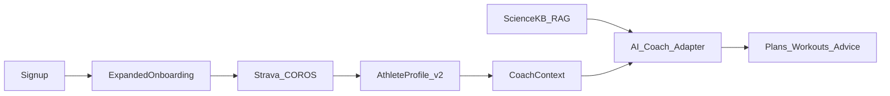

# AI Coach + Athlete Intelligence Platform

## Decisions locked

- **Coaching scope:** Endurance (run/cycle/swim) **and** general fitness (strength/mobility) from day one.
- **Email:** Soft verification — onboarding proceeds immediately after signup; verify email is encouraged but not a gate.
- **AI:** Provider-agnostic adapter (evaluate Gemini / Claude / GPT); **do not fine-tune**. Use **RAG + rules + structured athlete context** (industry-proven and safer for health).

## Current baseline (already in repo)

- Signup → JWT immediately ([`backend/app/routes/auth.py`](backend/app/routes/auth.py)); **no** email verify today.
- 10-step wizard ([`frontend/src/utils/onboardingSteps.js`](frontend/src/utils/onboardingSteps.js), [`OnboardingWizard.jsx`](frontend/src/components/OnboardingWizard.jsx)) → Strava/COROS connect.
- Profile has age/weight/goals/injuries/fitness prefs; **missing** height, sex, blood type, structured sports, training history.
- Coach stub: [`GET /api/coach/context`](backend/app/routes/coach.py) + [`athlete_coach_context.py`](backend/app/services/athlete_coach_context.py) — ready for an LLM, no generation yet.



---

## Phase 0 — Foundations (1–2 weeks)

**Goal:** Data model + soft email + expanded intake. No LLM spend yet.

### 0.1 Soft email verification

- Add `users.email_verified_at`, `email_verify_token_hash`, `email_verify_sent_at`.
- Endpoints: `POST /api/auth/verify-email/request`, `POST /api/auth/verify-email/confirm`.
- After register: send verify email async; **do not block** `/onboarding`.
- UI: non-blocking banner “Verify your email” on AppShell until verified; Profile/Settings can resend.
- Start with console/log provider or Resend/SMTP behind config (`EMAIL_PROVIDER`).

### 0.2 Athlete Profile v2 (schema)

Extend [`AthleteProfile`](backend/app/models.py) + migrate ([`migrate.py`](backend/app/migrate.py)):

| Area                           | Fields                                                                                                                   |
| ------------------------------ | ------------------------------------------------------------------------------------------------------------------------ |
| Body                           | `height_cm`, `sex` (female/male/other/prefer_not), `date_of_birth` (prefer over age alone), keep `age` derived or synced |
| Clinical (optional, sensitive) | `blood_type` (nullable), structured injuries table below                                                                 |
| Fitness snapshot               | `training_history_months`, `current_weekly_volume` (JSON by sport), `longest_recent_session`, race/PR notes              |
| Time budget                    | keep `days_per_week`, `workout_duration_minutes`; add `weekly_minutes_budget`                                            |
| Sports                         | `primary_sports[]`, `secondary_sports[]` (run, ride, swim, strength, yoga, etc.)                                         |
| Goals                          | keep primary/secondary; add `goal_event_date`, `goal_event_name`, `goal_metric` (e.g. finish time)                       |
| Preferences                    | equipment, hate/love exercises (existing)                                                                                |

**New tables (normalized, safer for AI):**

- `athlete_injuries` — body_region, condition, status (active/past), onset_date, notes, severity
- `athlete_sports` — sport, experience_level, weekly_preference_days
- `athlete_consents` — AI coaching, health data use, research (boolean + timestamp)

Privacy: blood type + medical = optional; never required for onboarding completion; redact from logs.

### 0.3 Redesigned onboarding UX (Runna / Rest-or-Train style)

Rewrite steps in [`onboardingSteps.js`](frontend/src/utils/onboardingSteps.js) into **short themed screens** (not one giant form):

1. Welcome / why we ask
2. Sex, DOB/age, height, weight
3. Primary sports (multi) + experience per sport
4. Goal + optional event date
5. Current fitness & training history (level, months training, recent weekly volume)
6. Weekly time (days + session length + total minutes)
7. Schedule preferences (time of day)
8. Injuries (structured chips + free text) — skippable detail
9. Equipment + movement prefs
10. Optional: blood type / other notes — clearly optional
11. Review + consents (AI coaching, data use)
12. Existing Strava → COROS connect flow

Map submit to expanded `POST /api/profile/onboarding`. Profile page must edit the same fields later.

### 0.4 High-impact extras (include now)

- **Readiness gate copy** on coach: “Not medical advice”; escalate red flags (chest pain, acute injury) to “see a professional.”
- **Units** preference (metric/imperial) on profile — used in all AI outputs.
- **Baseline from wearables:** after first COROS/Strava sync, suggest “confirm estimated fitness” (VO2/RHR from synced data) instead of guessing.

---

## Phase 1 — Scientific knowledge backend (2–4 weeks, parallel with 0)

**Goal:** Curated, citable knowledge the AI retrieves — not “train the model” via fine-tuning.

### Architecture

- Store chunks in Postgres (+ `pgvector` when ready) or start with JSON/markdown corpus + embeddings table.
- Tables: `science_sources` (title, authors, year, license, url), `science_chunks` (source_id, sport_tags, topic_tags, text, embedding).
- Ingest pipeline (scripts under `backend/scripts/science_ingest/`): chunk → embed → upsert.
- Retrieval service: `retrieve_science(query, sports[], topics[], k)` used by coach.

### Knowledge domains (both C scopes)

**Endurance:** periodization (base/build/peak/taper), 10% rule caveats, polarized vs pyramidal intensity, ACWR concepts (already in product), swim/bike/run specificity, heat/altitude basics.  
**General fitness:** progressive overload, FITT-VP, RPE, strength frequency, mobility, beginner vs intermediate templates.  
**Shared safety:** injury red flags, return-to-play conservatism, pregnancy/relative energy deficiency **as referral-only** topics (not diagnose).

### Source policy (critical)

- Prefer **open guidelines / textbooks with clear license** (ACSM public summaries, open-access reviews, WHO activity guidelines, your own coach-written playbooks).
- **Do not** scrape copyrighted books/paywalled PDFs into the KB.
- Every chunk keeps citation metadata so the AI can say “based on X” or stay silent.

### Deterministic layer (often more valuable than the LLM)

Extend readiness rules in [`athlete_coach_context.py`](backend/app/services/athlete_coach_context.py):

- Hard caps: max weekly load increase %, min rest after poor sleep/HRV flags.
- Injury filters: exclude contraindicated patterns from plan templates.
- LLM proposes; **validator** rejects unsafe plans before user sees them.

---

## Phase 2 — AI provider research + adapter (1–2 weeks research, then wire)

**Goal:** Pick a default provider with evidence; keep swap cost near zero.

### Evaluation harness (build before committing spend)

- Golden set of ~30 synthetic athletes (beginner runner, injured cyclist, strength+endurance hybrid, low-time parent, etc.).
- Score outputs: safety, FITT-VP structure, personalization, schedule fit, citation grounding, JSON schema validity.
- Candidates: **Claude** (strong in recent exercise-prescription studies), **GPT-4o-class**, **Gemini** (your option — good multimodal/cost; validate on safety + structure).
- Decision record: `docs/ai-provider-evaluation.md` with scores → choose **primary + fallback**.

### Adapter design (implement regardless of winner)

```
CoachProvider (protocol)
  generate_week_plan(context, science_hits) -> PlanJSON
  daily_advice(context, science_hits) -> AdviceJSON
  chat(messages, context, science_hits) -> ChatJSON
```

- Config: `AI_PROVIDER=claude|openai|gemini`, API keys in env.
- Force **structured JSON** responses (Pydantic validate).
- Log prompts/responses with PII redaction for debugging.

### Product surfaces (MVP AI)

1. **Weekly plan generation** from profile + schedule + sports.
2. **Today’s readiness advice** using existing `readiness_flags` + health metrics.
3. **Coach chat** on `/coach` that always receives `coach/context` + top-k science chunks.
4. Persist plans to DB (`training_plans` / `planned_workouts`) so Schedule can show them.

Reuse [`CoachPage.jsx`](frontend/src/pages/CoachPage.jsx) — replace raw JSON dump with plan UI + chat.

---

## Phase 3 — Closed loop (ongoing differentiation)

What makes this beat ChatGPT alone (and match Runna-class apps):

- Adapt next week from **completed activities** (compliance, ACWR, missed sessions).
- “Reschedule week” when life happens.
- Sport-aware splits: endurance sessions from streams; strength from structured sets when available.
- Optional: export planned workouts to calendar; later watch push.

---

## What we will not do (by design)

- Fine-tune a custom model on medical/sports text as v1 (costly, stale, weak safety).
- Block users on email verification.
- Claim diagnosis or prescribe for clinical conditions — coach + refer.
- Dump unlicensed commercial training books into the KB.

---

## Suggested delivery order

1. Profile v2 + expanded onboarding + consents
2. Soft email verify banner
3. Science corpus v0 (playbooks you author + open guidelines) + retrieve API
4. Provider eval harness → pick primary
5. Adapter + weekly plan + daily advice + coach chat
6. Plan persistence into Schedule + adaptation loop

## Success metrics

- Onboarding completion rate; % profiles with sports + time budget filled.
- % plans that pass safety validator first try.
- User edit rate on generated weeks (lower = better fit).
- Email verify rate within 7 days (soft metric).
