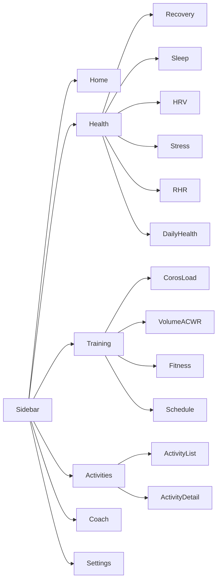

# App Shell + Dashboard UX Redesign

## Recommendations (before build)

Committed defaults based on your goals and current stack:

1. **Phased delivery** — do not rebuild Home + every metric page + COROS history drill-down in one pass. Ship a solid shell and Home first, then metric pages, then interactive history.
2. **Hybrid Home** (Whoop readiness + Strava training clarity): today readiness glance → training graphs → recent activities table. Deep detail lives on section pages.
3. **Garmin-style IA**: collapsible sidebar with **section groups** and **sub-items** (Sleep under Health, not a flat mega-list).
4. **Visual system**: keep your existing sage accent; refine light/dark tokens for a performance-coach look (clean light surfaces, deep charcoal dark). Avoid generic purple gradients / cream-terracotta AI defaults. Reuse Recharts + Framer Motion already in the app.
5. **Data strategy**: charts read from Postgres first; on-demand COROS MCP range fetch only when the user expands history beyond cached lookback.
6. **Extra COROS metrics to add** (available via MCP, not yet first-class UI): steps/calories as Daily Health; devices; health-check / stress time-series (for detail pages); menstrual cycle (gated/opt-in); avg HR trend; activity lap detail later.

Interactive “click Recovery → week/month chart” is **Phase 3** (after shell + dedicated pages exist).

---

## Target information architecture

| Sidebar group | Routes |
|---|---|
| Home | `/dashboard` |
| Health & Recovery | `/health/recovery`, `/health/sleep`, `/health/hrv`, `/health/stress`, `/health/rhr`, `/health/daily` |
| Training | `/training/load`, `/training/volume`, `/training/fitness`, `/training/schedule` |
| Activities | `/activities` (+ existing `/activities/:id`) |
| Coach | `/coach` (readiness flags + context stub for future AI) |
| Settings / Profile | existing `/settings`, `/profile` |

Mobile: sidebar becomes a drawer; top bar keeps brand + theme + user menu.

---

## Phase 1 — App shell + Home redesign + activity table

**Goal:** unclutter Dashboard; establish navigation and design system.

### 1A. Layout shell
- New [`frontend/src/components/layout/AppShell.jsx`](frontend/src/components/layout/AppShell.jsx): left sidebar + main content.
- New [`frontend/src/components/layout/Sidebar.jsx`](frontend/src/components/layout/Sidebar.jsx): section groups, active route highlight, collapse on desktop, drawer on mobile.
- Wrap authenticated pages in AppShell via [`frontend/src/App.jsx`](frontend/src/App.jsx); slim [`Navigation.jsx`](frontend/src/components/Navigation.jsx) into a top bar inside the shell (or fold into AppShell).

### 1B. Design tokens
- Extend Tailwind/CSS variables in the existing theme ([`ThemeProvider.jsx`](frontend/src/context/ThemeProvider.jsx) / global CSS): surface, border, muted text, accent (sage), success/warn/danger for readiness.
- Shared primitives: `PageHeader`, `SectionCard`, `StatTile`, `EmptyState`, `RangeTabs` (This week / This month / … — used later on detail pages too).

### 1C. Home `/dashboard` (replace stacked mess)
Current stack in [`Dashboard.jsx`](frontend/src/components/Dashboard.jsx) dumps Coros panels + DailyGlance + ActivityHistory. Replace with:

1. **Today strip** — Recovery %, sleep score, HRV, RHR, readiness flags (links to detail pages).
2. **Training graphs row** — COROS load ratio sparkline + existing ACWR/volume (from [`DailyGlance.jsx`](frontend/src/components/DailyGlance.jsx) pieces, re-laid out).
3. **Schedule peek** — next 3 COROS plan items (or empty CTA).
4. **Recent activities** — redesigned table (below), not endless cards.

Keep sync status as a quiet banner, not a wall of panels.

### 1D. Activity table (match your reference image)
Redesign [`ActivityHistory.jsx`](frontend/src/components/ActivityHistory.jsx) (and list API if needed):

- Tabs: View all / This month / Next month N/A → **This week / This month / This year / All**
- Search input + Filters button (sport type, provider Strava/COROS)
- Table: sortable columns (date, name, sport, distance, time, avg HR, provider); row action → detail
- Footer pagination like the screenshot: **Total: N** | page numbers + prev/next | **Show per page** (5/10/25)
- Light + dark styles consistent with tokens

Backend: extend [`/api/activities`](backend/app/routes/activities.py) with `q`, `sport`, `provider`, `from`, `to`, `page`, `page_size`, `sort` and return `{ items, total, page, page_size }`.

---

## Phase 2 — Dedicated metric pages + charts

Each page: header (title, last synced, range tabs stub), primary chart, supporting stats, empty/connect COROS states.

| Page | Chart focus | Data source |
|---|---|---|
| Recovery | Recovery % over stored snapshots | `fitness_assessments` |
| Sleep | Score + duration + stage mix | `daily_health_metrics` |
| HRV | Daily HRV + assessment | `daily_health_metrics` |
| Stress | Daily stress | `daily_health_metrics` |
| RHR | Resting HR trend | `daily_health_metrics` |
| Daily Health | Steps + calories | `daily_health_metrics` |
| COROS Load | Short/long/ratio + comments | `training_load_snapshots` |
| Volume & ACWR | Existing distance ACWR | `training_load.py` / activities |
| Fitness | VO2max, threshold, race preds | `fitness_assessments` |
| Schedule | Week list/calendar | `coros_schedule_items` |
| Coach | Flags + context JSON summary | `/api/coach/context` |

API: add `/api/coros/metrics/{metric}?from=&to=` (or reuse/extend health/fitness/load endpoints) returning series suitable for Recharts.

Move current panel components under `frontend/src/pages/health/*` and `pages/training/*` instead of dumping them on Home.

---

## Phase 3 — Interactive COROS-style history

On each metric page:

- Clicking a StatTile / “Explore history” opens a **detail panel or full history mode**
- Range controls: 7D / 4W / 3M / 6M / 1Y / All (cached)
- If cache misses, backend backfills via MCP with `yyyyMMdd` ranges (reuse [`coros_text_parsers.py`](backend/app/services/coros_text_parsers.py))
- Persist longer history in existing tables; raise lookback defaults for nightly sync

Recovery/Fitness: history = **our snapshot archive** + live current value (MCP does not give a full all-time recovery calendar in one call).

---

## Extra COROS metrics (fold into Phase 2)

- **Daily Health page**: steps, calories, exercise duration (parse more fields if needed)
- **Devices** subsection under Settings (from `queryDevices`)
- **Avg HR** trend on Daily Health or RHR page companion
- **Opt-in** menstrual cycle page/section if MCP data exists (`queryMenstruationCycles`)
- Stress/health-check **time-series** for high-zoom detail (7-day MCP windows)

Out of scope for this redesign: LLM workout generation, push plans to COROS calendar.

---

## Implementation order

1. Design tokens + AppShell/Sidebar + route map
2. Home dashboard rewrite (summary only)
3. Paginated/filterable activities table + API
4. Metric page templates + Health routes
5. Training routes + Coach page
6. Extra metrics sync/UI
7. Interactive week/month history (Phase 3)

---

## Success criteria

- No single scrolling “everything” dashboard; Home is scannable in one viewport + short scroll
- Sidebar navigates all Health/Training/Activities sections
- Activity table matches reference pattern (tabs, search, filters, pagination, per-page)
- Light and dark modes feel intentional and consistent
- Each metric has its own graph page
- Clear path to COROS-style history without blocking Phase 1
