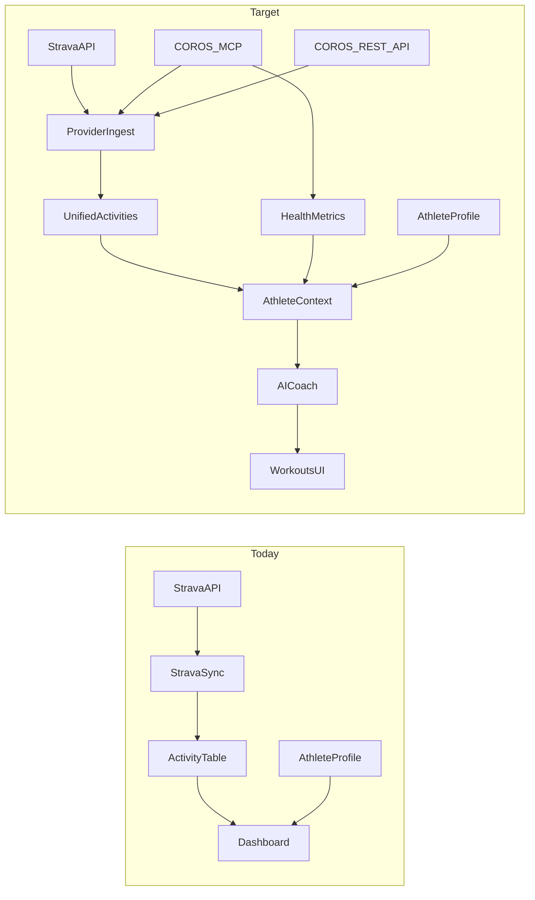

# COROS Integration Plan for Advance Athlete Lab

## What COROS MCP actually is (important)

COROS did **not** ship a Strava-style public REST SDK for arbitrary apps as the primary consumer path. They shipped an official **remote MCP server** at [`https://mcp.coros.com/mcp`](https://mcp.coros.com/mcp) (with regional fallbacks: `mcpus` / `mcpeu` / `mcpcn`).

That means:

- An AI/runtime **MCP client** authorizes a COROS account (OAuth-style HTTP), then calls named tools.
- It is built for **AI assistants** (Claude, ChatGPT, Cursor) and for **your own backend** if you implement an MCP client.
- Separately, COROS still has a **formal third-party REST API** onboarding path (`api@coros.com` / [Submit an API Application](https://support.coros.com/hc/en-us/articles/17085887816340-Submit-an-API-Application)) for production multi-tenant products — same pattern as Strava OAuth apps.

**Chosen approach for Advance Athlete Lab: Hybrid**

1. **Refactor data model** so Strava + COROS (and future providers) share one activity/connection shape.
2. **Near-term:** backend MCP client → sync + coach-time enrichment via official COROS MCP tools.
3. **Parallel:** apply for official COROS REST API for durable multi-user OAuth/sync (production-grade).
4. **AI coach:** consume unified athlete context (profile + activities + COROS health/EvoLab) to generate workouts.

This matches your product goal (“feed COROS details into AI workouts”) better than either “only live MCP” or “only mirror Strava.”

---

## Why COROS makes the product meaningfully better than Strava-only

| Capability                                      | Strava today in your app               | COROS MCP adds                                                                             |
| ----------------------------------------------- | -------------------------------------- | ------------------------------------------------------------------------------------------ |
| Activity list / distance / time / HR avg        | Yes                                    | Yes (`querySportRecords`, `getActivityDetail`)                                             |
| Streams / charts                                | FIT or streams → Parquet               | FIT via `downloadActivityFitFiles` / URL tools (**50 FIT downloads/day/account**)          |
| Sleep, HRV, stress, RHR                         | No                                     | Yes (`querySleepData`, `querySleepHrv`, `queryStressLevel`, etc.)                          |
| Recovery % / readiness                          | No                                     | Yes (`queryRecoveryStatus`)                                                                |
| VO2max, threshold pace, race predictions        | No                                     | Yes (`queryFitnessAssessmentOverview`)                                                     |
| Official training load (acute/chronic comments) | Your own distance ACWR only            | Yes (`queryTrainingLoadAssessment`)                                                        |
| Existing COROS training schedule                | No                                     | Yes (`queryTrainingSchedule`)                                                              |
| Push AI plan to watch calendar                  | N/A                                    | **Coming soon** (`generateTrainingPlan` / `updateTrainingPlan`, targeted before ~Sep 2026) |
| AI/ML use of data                               | **Strava API ToS restricts AI/ML use** | COROS explicitly positioned data for AI coaching                                           |

Net: Strava remains a great social/activity source; **COROS becomes the physiological + readiness layer your AI coach needs**.

Official MCP tool surface (current):

- **Activities:** `querySportRecords`, `getActivityDetail`, `analyzeActivityDetail`, `queryActivityLapData`, `queryCustomActivityLapData`, `downloadActivityFitFiles`, `queryActivityFitFileDownloadUrls`
- **Health:** `queryDailyHealthData`, `querySleepData`, `querySleepHrv`, `queryAvgHeartRate`, `queryRestingHeartRate`, `queryStressLevel`, `queryHealthCheckTimeSeries`, `queryStressTimeSeries`, `queryRecoveryStatus`, `queryMenstruationCycles`
- **Training:** `queryFitnessAssessmentOverview`, `queryTrainingLoadAssessment`, `queryTrainingSchedule` (+ write tools soon)
- **Profile:** `queryUserInfo`, `queryDevices`

Sources: [coroslab/COROS-MCP](https://github.com/coroslab/COROS-MCP), [COROS MCP update log](https://coros.com/stories/coros-metrics/c/mcp-testing).

---

## Current system constraints (what blocks a clean drop-in)

From your codebase:

- [`backend/app/models.py`](backend/app/models.py): `Activity.strava_activity_id` is required + unique with athlete; `StravaConnection` is Strava-only; onboarding flag is `strava_onboarding_done`.
- Sync/import/webhook paths are Strava-branded (`strava_sync.py`, `/strava/webhook`, Strava ZIP importer).
- Parquet paths keyed like `{athlete}/{strava_activity_id}.parquet`.
- AI workout generation is **not built yet** — onboarding fields exist as future coach inputs; no LLM stack in `requirements.txt`.
- Training load ([`training_load.py`](backend/app/services/training_load.py)) aggregates all activities by distance — once COROS rows share the table, volume/ACWR keep working; readiness needs new tables.



---

## Architecture to implement

### 1) Provider-agnostic core (do this first)

Refactor identity without breaking existing Strava data:

- Replace Strava-only uniqueness with:
  - `provider` (`strava` | `coros`)
  - `external_activity_id` (string/bigint-compatible)
  - unique `(athlete_profile_id, provider, external_activity_id)`
- Introduce `ProviderConnection` (or keep `StravaConnection` + add `CorosConnection`, then unify later). Prefer one table early:
  - `provider`, `external_user_id`, tokens / refresh / expiry, `scopes`, `last_synced_at`, `meta_json`
- Parquet path: `activity_points/{athlete_id}/{provider}/{external_id}.parquet`
- Onboarding: rename UX to “Connect training sources”; keep Strava optional; add COROS connect; store `coros_onboarding_done` or generic `wearable_onboarding_done`.

Migration strategy: backfill existing rows as `provider='strava'`, rename column in place or dual-write then drop `strava_activity_id`.

### 2) COROS MCP client service (near-term data + AI bridge)

Add something like `backend/app/services/coros_mcp.py`:

- MCP HTTP client to `https://mcp.coros.com/mcp` (respect regional redirect / fallback URLs).
- Per-athlete OAuth: browser authorize → store tokens on `ProviderConnection`.
- Sync jobs (mirror Strava pattern in [`strava_sync.py`](backend/app/services/strava_sync.py)):
  - List: `querySportRecords` (date windows, incremental)
  - Detail: `getActivityDetail` + optional laps
  - Streams: selective `downloadActivityFitFiles` → reuse [`fit_converter.py`](backend/app/services/fit_converter.py) (respect **50 FIT/day** quota; prioritize recent / race / key sessions)
- Health sync into new tables (not jammed into `activities`):
  - `daily_health_metrics` (steps, calories, RHR, stress, sleep summary, HRV)
  - `fitness_assessments` (VO2max, threshold pace, race preds, recovery %)
  - `training_load_snapshots` (COROS short/long load + comments)
- Coach-time “fresh” fetch: before generating a plan, call `queryRecoveryStatus` + last 7d sleep/HRV + `queryTrainingLoadAssessment` so the AI sees today’s readiness, not only cached nightly sync.

**Do not** scrape unofficial COROS mobile APIs (community MCPs do this). Use official MCP / official REST only.

### 3) Official COROS REST API (parallel production track)

Email `api@coros.com` and complete onboarding for Client ID/Secret + redirect URIs (same mental model as Strava in [`config.py`](backend/app/config.py) / [`routes/strava.py`](backend/app/routes/strava.py)).

Once credentials exist:

- Prefer REST for bulk historical sync + webhooks if offered.
- Keep MCP for tools that REST may not expose cleanly (coach analysis, schedule IDs, upcoming write-plan tools).

### 4) Cross-provider dedupe

Athletes often have the **same run on Strava and COROS**.

- Fingerprint: start time ±2–3 min + distance ±2% + duration ±5% (+ sport family).
- Store `canonical_activity_id` / merge links; dashboard and AI should count a session once.
- Prefer COROS for physiology fields; prefer Strava for social metadata if both exist.

### 5) Frontend product changes

- New connect flow parallel to [`ConnectStrava.jsx`](frontend/src/components/ConnectStrava.jsx): Connect COROS.
- Settings: multi-provider status, sync buttons, disconnect.
- Dashboard: show recovery / sleep / VO2max cards when COROS connected (new signals Strava never gave you).
- Keep charts on unified activities.

### 6) AI coach context contract (build toward this even before full LLM)

Define a single `AthleteCoachContext` builder used by future generation endpoints:

```text
profile (goals, days/week, injuries, equipment)
+ recent activities (normalized, deduped)
+ coros.recovery / sleep / hrv / stress (last 7–28d)
+ coros.fitness (VO2max, threshold, race preds)
+ coros.training_load (official) + your ACWR
+ optional current COROS schedule
→ prompt / tool-calling agent → structured WorkoutPlan
```

Phased AI delivery:

1. **Rules + templates** using recovery/load gates (safe intensity when recovery low).
2. **LLM generation** with structured JSON output (sessions, zones, duration).
3. When COROS write tools ship: optional “Push to COROS calendar.”

Strategic note: for AI features, **prefer COROS-sourced metrics** over Strava-sourced ones where possible, given Strava’s API restrictions on AI/ML.

---

## Recommended delivery phases

### Phase 0 — Access & spike (1–3 days)

- Connect COROS MCP in Cursor against a real athlete account; inventory live tool schemas/params.
- Spike a small Python MCP client (list sports records + recovery).
- Submit COROS REST API application in parallel.

### Phase 1 — Schema + Strava compatibility (3–5 days)

- Migrate `Activity` / connections / parquet keys to provider-agnostic.
- Keep Strava sync green; no UX regression.

### Phase 2 — COROS connect + activity sync (1–2 weeks)

- OAuth/MCP auth UX, connection storage, sync endpoints (`/api/coros/*` mirroring Strava).
- Import summaries; selective FIT → Parquet.
- Dedupe vs Strava.

### Phase 3 — Health / EvoLab layer (1 week)

- Daily health + fitness assessment + training load tables.
- Dashboard readiness widgets.
- Nightly + on-demand refresh jobs (per-athlete locks, not global `sync_status` dict).

### Phase 4 — AI coach v1 (1–2 weeks after context exists)

- `AthleteCoachContext` assembler.
- Workout generation API using onboarding + COROS readiness.
- Persist `WorkoutPlan` / sessions in DB; UI calendar.

### Phase 5 — Bidirectional COROS (when write tools GA)

- Push generated plans via `generateTrainingPlan` / `updateTrainingPlan`.

---

## Risks and constraints to plan around

- **MCP is AI-protocol, not a full partner API:** rate limits, auth session quirks, and regional redirects (`mcp.coros.com` → regional host) must be handled; some AI platforms already struggle with redirects.
- **FIT quota 50/day:** cannot blindly backfill years of streams via MCP; summaries first, FIT for recent/key workouts.
- **Read-only today:** cannot push workouts to the watch until write tools land.
- **Auth hardening:** activity/provider routes currently trust `athlete_profile_id` query params; multi-provider makes ownership checks mandatory (JWT bind).
- **Global in-memory sync lock:** must become per-athlete/per-provider before concurrent Strava+COROS sync.
- **Legal/product:** document what data you store vs query live; revoke/disconnect path required.

---

## Immediate next actions (when you approve implementation)

1. Spike MCP client + document exact tool JSON schemas from a live connect.
2. Design/apply DB migration for provider-agnostic activities + new health tables.
3. Apply to COROS REST API (`api@coros.com`) while building MCP path so production OAuth is not blocked.
4. Ship Connect COROS + sync + readiness metrics before investing in LLM workout generation.

---

## Bottom line

COROS is the right second source for Advance Athlete Lab: it unlocks **sleep, HRV, recovery, VO2max, official training load, and (soon) plan write-back** — exactly the signals an AI coach needs that your Strava pipeline cannot provide. Treat COROS MCP as the **AI-facing data bus**, refactor your schema so Strava is one provider among many, sync/cache what the dashboard needs, and call MCP live at coach-time for readiness. Apply for the official REST API in parallel so multi-user production auth is solid.
