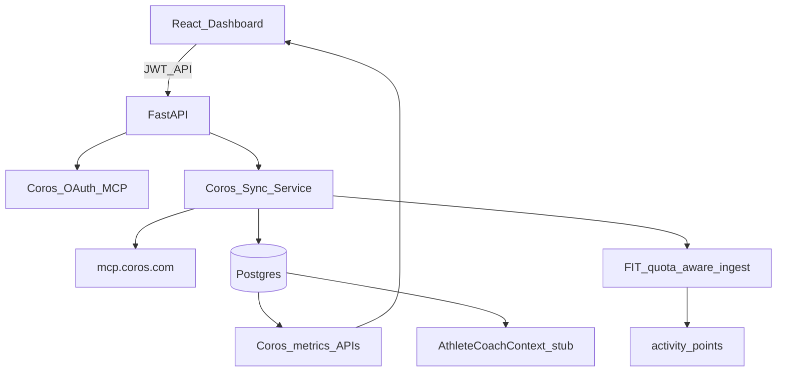

# COROS Stats MVP — Execution Plan

## Goal for this build

Ship a working end-to-end feature:

1. Athlete connects COROS (OAuth via official MCP).
2. Backend syncs and stores Coros metrics.
3. Dashboard shows **Sleep, HRV, stress, RHR, Recovery %, VO2max, threshold pace, race predictions, official training load (+ comments), and COROS training schedule** in clear units (Coros-like meaning; our UI).
4. Leave an `AthleteCoachContext` assembler so AI suggestions can plug in later — **no LLM workout generation in this build**.

**Approach:** Hybrid already decided — backend MCP client to `https://mcp.coros.com/mcp`, cache in Postgres, render in React. Apply to COROS REST API in parallel (email only; do not block MVP).

---

## Architecture

---

## Phase 1 — Provider-agnostic schema (unblock multi-source)

**Files:** [`backend/app/models.py`](backend/app/models.py), [`backend/app/migrate.py`](backend/app/migrate.py), Strava services that write `strava_activity_id`.

Changes:

- `Activity`: add `provider` (`strava`|`coros`), rename conceptual ID to `external_activity_id`; unique `(athlete_profile_id, provider, external_activity_id)`.
- Backfill existing rows: `provider='strava'`, `external_activity_id = strava_activity_id`.
- New `ProviderConnection` (or `CorosConnection` first if faster — **commit to `ProviderConnection`**): provider, external_user_id, access/refresh tokens, expires_at, last_synced_at, meta_json.
- Keep `StravaConnection` working via thin adapter that reads/writes the same provider row (`provider='strava'`) **or** migrate Strava rows into `ProviderConnection` in one migration — prefer **one table** to avoid dual paths.
- Parquet paths: `activity_points/{athlete_id}/{provider}/{external_id}.parquet`.
- Onboarding: add `coros_onboarding_done`; Settings supports both sources.

New tables for the stats feature:

| Table                     | Purpose                                                                                 |
| ------------------------- | --------------------------------------------------------------------------------------- |
| `daily_health_metrics`    | date, sleep_score, sleep stages, steps, calories, avg_hr, rhr, stress, hrv (+ raw_json) |
| `fitness_assessments`     | snapshot_at, vo2max, threshold_pace, race_preds JSON, recovery_pct, recovery_level      |
| `training_load_snapshots` | snapshot_at, short_load, long_load, load_ratio, daily_comments JSON                     |
| `coros_schedule_items`    | date, workout title/type, duration/metrics, coros ids, raw_json                         |

---

## Phase 2 — COROS MCP client + connect/sync APIs

**New backend modules (mirror Strava pattern):**

- [`backend/app/services/coros_mcp.py`](backend/app/services/coros_mcp.py) — HTTP MCP client, tool call helpers, regional URL fallback (`mcp.coros.com` → `mcpus`/`mcpeu`/`mcpcn`).
- [`backend/app/services/coros_sync.py`](backend/app/services/coros_sync.py) — orchestration + **per-athlete** job status (replace global lock pattern for Coros).
- [`backend/app/routes/coros.py`](backend/app/routes/coros.py) — auth URL, callback, status, sync, metrics read endpoints.
- Wire router in [`backend/app/main.py`](backend/app/main.py); config in [`backend/app/config.py`](backend/app/config.py).

**MCP tools used in sync:**

| Feature              | Tool                                                                     |
| -------------------- | ------------------------------------------------------------------------ |
| Activities           | `querySportRecords`, `getActivityDetail`                                 |
| Streams (selective)  | `downloadActivityFitFiles` / URL tools — **max 50 FIT/day**, recent only |
| Sleep / daily health | `querySleepData`, `queryDailyHealthData`, `querySleepHrv`                |
| Stress / RHR         | `queryStressLevel`, `queryRestingHeartRate`                              |
| Recovery             | `queryRecoveryStatus`                                                    |
| EvoLab               | `queryFitnessAssessmentOverview`                                         |
| Official load        | `queryTrainingLoadAssessment`                                            |
| Schedule             | `queryTrainingSchedule`                                                  |
| Profile seed         | `queryUserInfo`                                                          |

**API surface (JWT-bound to current user’s athlete):**

- `GET /api/coros/auth`
- `POST /api/coros/callback`
- `GET /api/coros/status`
- `POST /api/coros/sync`
- `GET /api/coros/sync/status`
- `GET /api/coros/health?from=&to=`
- `GET /api/coros/fitness`
- `GET /api/coros/training-load`
- `GET /api/coros/schedule?from=&to=`
- `GET /api/coros/overview` — single payload for dashboard (today + trends)

Dedupe vs Strava: fingerprint start±3min + distance±2% + duration±5%; store link so volume counts once.

---

## Phase 3 — Frontend: Connect COROS + Stats dashboard

**Connect / settings (parallel to Strava):**

- New [`frontend/src/api/coros.js`](frontend/src/api/coros.js)
- New `ConnectCoros.jsx` + `CorosCallback.jsx` (pattern from [`ConnectStrava.jsx`](frontend/src/components/ConnectStrava.jsx) / [`StravaCallback.jsx`](frontend/src/components/StravaCallback.jsx))
- Routes in [`App.jsx`](frontend/src/App.jsx); Settings section in [`SettingsPage.jsx`](frontend/src/components/SettingsPage.jsx)
- Onboarding: “Connect training sources” — Strava and/or COROS

**Stats UI (the feature we confirmed):**

Extend [`Dashboard.jsx`](frontend/src/components/Dashboard.jsx) / [`DailyGlance.jsx`](frontend/src/components/DailyGlance.jsx) with a **COROS Readiness** section when connected. Reuse [`MetricCard.jsx`](frontend/src/components/ui/MetricCard.jsx).

| Block         | Display units (Coros-like)                             |
| ------------- | ------------------------------------------------------ |
| Recovery      | Recovery % , level, estimated full recovery time       |
| Sleep         | Sleep score, total duration, deep/light/REM %, awake   |
| HRV           | Official HRV value + assessment / range                |
| Stress        | Daily stress score (+ short trend if available)        |
| RHR           | bpm                                                    |
| Fitness       | VO2max, threshold pace, 5K/10K/HM/Marathon predictions |
| Official load | Short-term, long-term, ratio, daily comments           |
| Schedule      | This week’s COROS planned sessions                     |

Placeholders when Coros not connected: CTA to connect. Keep existing Strava ACWR/volume section unchanged.

New components (concrete):

- `CorosReadinessPanel.jsx` — recovery + sleep + HRV + stress + RHR grid
- `CorosFitnessPanel.jsx` — VO2max / threshold / race preds
- `CorosTrainingLoadPanel.jsx` — official load + comments (alongside existing distance ACWR)
- `CorosSchedulePanel.jsx` — week calendar list

---

## Phase 4 — AI-ready stub (no generation yet)

- `backend/app/services/athlete_coach_context.py` builds a JSON context from profile + recent activities + latest Coros health/fitness/load.
- Endpoint `GET /api/coach/context` for future AI; dashboard may show a short “Ready for AI coaching” note with key readiness flags (e.g. low recovery → caution), rules-only — **no LLM dependency in this MVP**.

---

## Phase 5 — Hardening (same PR cycle)

- Bind Coros routes to JWT athlete ownership (fix IDOR on `athlete_profile_id`).
- Per-athlete sync locks; surface sync progress in UI.
- FIT quota counter per connection per UTC day.
- Document: apply to `api@coros.com` for future REST; env vars for MCP endpoint; disconnect/revoke.

---

## Explicitly out of scope for this execution

- Full LLM workout generation / RAG / science papers
- Push plans into COROS calendar (write tools not GA)
- Pixel-perfect Coros Training Hub clone
- Unofficial Coros mobile API scrapers
- Bulk historical FIT backfill beyond quota-safe recent window

---

## Build order (execution checklist)

1. Schema migration + Strava regression (activities/stats still work).
2. MCP client spike → auth/callback → store tokens.
3. Sync health + fitness + load + schedule (activities summaries next).
4. Read APIs + `overview` payload.
5. Connect COROS UI + Settings.
6. Dashboard panels with Coros units.
7. Selective activity/FIT ingest + dedupe.
8. Coach context stub + JWT hardening.

---

## Success criteria

- User can connect COROS and see sync complete.
- Dashboard shows the metric set above with correct units when data exists.
- Strava-only users unaffected; dual-connected users see both Strava load and Coros readiness.
- `GET /api/coach/context` returns unified JSON suitable for future AI suggestions.
