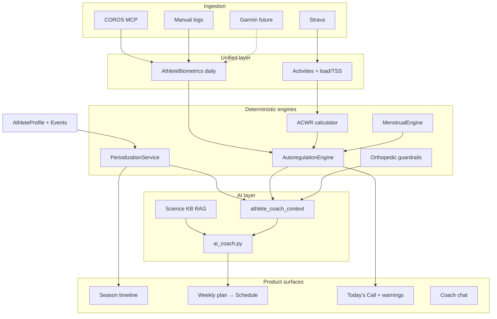

# Digital Twin Periodization Engine

**Source research:** [`.cursor/plans/master.plan.txt`](master.plan.txt)  
**Builds on:** [AI Coach Athlete Platform plan](ai_coach_athlete_platform_b6137cdb.plan.md) (Profile v2, science KB, AI adapter — completed)

## Vision

Commercial apps deliver **static training calendars**. When an athlete misses sessions, adds a race, or biometrics crash, the plan breaks.

We are building a **Dynamic Periodization Engine**:

1. **Anchor on A-race** and work **backward** (retrograde periodization).
2. **Route B/C/D/E races** inside the season without breaking A-race recovery.
3. **Autoregulate daily** from biometrics (HRV, sleep, ACWR, menstrual phase).
4. **Hard-guard injuries** (especially active lower back).
5. **Explain adjustments** via Science → Locker room → Analogy (existing AI voice).

**Architecture principle:** Python **rules + engines** own the season skeleton and daily permissions; the **LLM fills workouts and explains** — it does not invent macro periodization from scratch.



---

## Decisions locked

| Decision | Choice |
| -------- | ------ |
| Periodization model | Retrograde from A-race; default block ratios 40% Base / 30% Build / 20% Peak / 10% Taper (adjustable) |
| Race priorities | A (main), B (simulation), C (social/workout), D (zone test), E (other) |
| Daily permissions | Deterministic AutoregulationEngine; LLM must not override red veto |
| Menstrual tracking | Opt-in only; never required for onboarding |
| Load metric | Start with existing km + COROS effort; unify to TSS/effort in Phase C |
| AI scope | RAG + structured context; no fine-tuning |
| Medical | Not medical advice; escalate red flags to professional care |
| Session length | `workout_duration_minutes` = **typical**, not hard cap; long days allowed by phase |

---

## Current baseline (already in repo)

| Area | Status | Key files |
| ---- | ------ | --------- |
| Rich onboarding / Profile v2 | ✅ Done | `models.py`, `onboardingSteps.js`, Profile UI |
| Single A-race on profile | ✅ Done | `goal_event_name`, `goal_event_date`, `goal_metric` |
| FTP / LTHR / max HR | ✅ Done | `ftp_watts`, `lthr_bpm`, `max_hr_bpm` on profile |
| Structured injuries | ✅ Done | `athlete_injuries` table |
| Science KB + RAG | ✅ Done | `science_kb.py`, `backend/data/science_corpus/` |
| AI coach (weekly, daily, chat) | ✅ Done | `ai_coach.py`, `coach_ai.py` |
| ACWR (distance km) | ✅ Partial | `training_load.py` |
| COROS effort load | ✅ Partial | `coros_metrics.py`, Training Load page |
| Coach safety rules | ✅ Partial | `coach_safety.py` |
| Menstrual snapshot | ⚠️ Raw only | `CorosCycleSnapshot` — no phase engine |
| Multi-race calendar | ❌ Missing | — |
| Season phases | ❌ Missing | — |
| Autoregulation engine | ❌ Missing | ACWR mentioned in prompts only |
| Unified daily biometrics | ❌ Missing | Sleep/HRV per-metric pages only |
| Phase-aware AI | ❌ Missing | — |

---

## Race priority rules (reference)

| Priority | Role | Taper | Post-event | System behavior |
| -------- | ---- | ----- | ---------- | --------------- |
| **A** | Championship target | ~2 weeks progressive (−40–60% volume, keep intensity) | ~1 week mandatory restore | All phases orient here |
| **B** | Simulation / tune-up | 3-day mini-taper (−30% volume) | 3-day active recovery | Calibrate A-race pacing |
| **C** | Social / Parkrun | None | None | Hard workout in normal week |
| **D** | FTP / LTHR test | None | Light | Auto-update training zones if accepted |
| **E** | Other | Flexible | Flexible | User-defined notes |

**Validation rules (enforce in PeriodizationService):**
- No B-race within 14 days of A-race without warning.
- No double full taper (B then A within 10 days).
- C-race never triggers taper or extra rest days.
- D-race schedules guided test protocol template.

---

## Phase block definitions (reference)

| Phase | Science focus | Training emphasis |
| ----- | ------------- | ----------------- |
| **Prep / Base** | Capillary density, mitochondrial volume, structural strength | Z2 volume, mobility, unilateral "armor" strength |
| **Build** | Raise LT2 / FTP | Tempo, over-unders, threshold intervals |
| **Peak** | Race-specific economy | Race-pace simulations, long Z2 + pace work |
| **Taper** | Neuromuscular supercompensation | −40–60% volume, short intense touches |
| **Rest / Restore** | Parasympathetic repair | Post-A-race; yoga, mobility, active recovery |

Insert **recovery week** every 3–4 training weeks (−30% volume, keep frequency).

---

## Phase A — Season skeleton (build first)

**Goal:** Multi-race season plan + phase-aware weekly coach. Highest product value; no new wearable dependencies.

**Estimated effort:** 2–3 weeks

### A.1 Database schema

**New models** in [`backend/app/models.py`](backend/app/models.py):

```python
# athlete_events
- id (UUID or int PK)
- athlete_profile_id (FK)
- name (str)
- date (date)
- priority (enum: A, B, C, D, E)
- sport_type (enum: run, bike, swim, strength, other)
- target_metric (str, nullable)  # e.g. "1:35:00", "21 km"
- status (enum: planned, completed, cancelled)
- notes (text, nullable)
- result_metric (str, nullable)   # filled post-race
- created_at, updated_at

# season_plans
- id
- athlete_profile_id (FK)
- a_race_event_id (FK → athlete_events)
- start_date (date)               # plan generation date
- end_date (date)                 # A-race date
- status (enum: draft, active, completed, archived)
- template_key (str)              # e.g. half_marathon_intermediate
- created_at, updated_at

# season_phases
- id
- season_plan_id (FK)
- phase_type (enum: base, build, peak, taper, restore, recovery_week)
- start_date, end_date (date)
- week_count (int)
- intent (text)                   # human-readable focus
- volume_bias (float, nullable)   # relative to athlete baseline
- intensity_bias (str, nullable)  # low | moderate | high
- sort_order (int)
```

**Migration:** [`backend/app/migrate.py`](backend/app/migrate.py)

**API routes:** `backend/app/routes/season.py` (or extend `athlete.py`)
- `GET /api/season` — active plan + phases + events
- `POST /api/season/generate` — build/rebuild from A-race + events
- `GET/POST/PATCH/DELETE /api/events` — CRUD for athlete events

**Schemas:** [`backend/app/schemas.py`](backend/app/schemas.py)

**Acceptance:**
- Athlete can store A-race + multiple B/C/D events.
- Season plan generates phases from today → A-race date.
- B-race weeks flagged in phase metadata.

---

### A.2 PeriodizationService

**New file:** [`backend/app/services/periodization.py`](backend/app/services/periodization.py)

**Core functions:**

```python
def weeks_until(race_date: date, from_date: date | None = None) -> int
def distribute_phases(total_weeks: int, sport: str, fitness_level: str) -> list[PhaseBlock]
def apply_race_adapters(phases: list, events: list[Event]) -> list[PhaseWeek]
def build_season_plan(profile, events, today) -> SeasonPlanResult
def get_current_phase(season_plan, today) -> SeasonPhase | None
def get_week_intent(season_plan, week_start) -> WeekIntent  # volume/intensity/focus
```

**Default phase ratios** (adjust when `total_weeks < 8` or injury flags):
- Base 40%, Build 30%, Peak 20%, Taper 10%
- Post-A Restore: 1 week (auto-insert after A-race date)

**Race adapters:**
- **B-race week:** mark days −3..−1 as mini-taper; race day high intensity; +3 days recovery.
- **C-race:** embed as quality session on preferred day; no schedule mutation elsewhere.
- **D-race:** embed test protocol; flag `recalibrate_zones=True` on completion.

**Tests:** `backend/tests/test_periodization.py`
- 16-week half marathon → expected phase counts
- B-race 6 weeks before A → mini-taper + recovery inserted
- C-race does not reduce surrounding volume
- Invalid B-race 5 days before A → warning flag

**Acceptance:**
- Given Tata Mumbai Half Jan 17 2027, generates Base→Build→Peak→Taper blocks from today.
- `get_current_phase()` returns correct block for any date in season.

---

### A.3 Frontend — Events + Season timeline

**Profile / onboarding:**
- Extend event section: primary A-race (existing) + "Add race" for B/C/D.
- Priority picker, date, sport, target time/distance.

**New page:** `frontend/src/pages/SeasonPage.jsx` (route `/coach/season` or `/training/season`)
- Horizontal or vertical timeline: phases as colored bands.
- Race markers (A=gold, B=silver, C=gray, D=teal).
- Current phase highlight + "Week X of Y in Build".
- Link from Coach sidebar.

**API client:** `frontend/src/api/season.js`

**Acceptance:**
- User sees full season at a glance.
- Adding B-race updates timeline without manual refresh break.

---

### A.4 Coach integration — phase-aware AI

**Extend:** [`backend/app/services/athlete_coach_context.py`](backend/app/services/athlete_coach_context.py)

Add to context packet:
```json
{
  "season": {
    "a_race": { "name", "date", "target" },
    "current_phase": { "type", "week_in_phase", "intent" },
    "upcoming_events": [{ "name", "date", "priority", "days_until" }],
    "week_intent": { "volume_bias", "intensity_focus", "long_session_allowed_min" }
  }
}
```

**Extend:** [`backend/app/services/ai_coach.py`](backend/app/services/ai_coach.py)
- Weekly plan prompt: must respect `current_phase` and `week_intent`.
- Explicit instruction: typical session length is not a hard cap; long days OK when phase allows.
- Upcoming B-race within 10 days → reduce volume, no new quality stacking.

**Acceptance:**
- Generated weekly plan references current phase (e.g. "Build week 3").
- Plan includes 1 long session > 60 min when in Base/Build for multi-sport athlete.

---

### A.5 Session budget fix

**Problem (Todo #1):** AI treats `6 days × 60 min = 360 min` as hard per-session cap.

**Fix:**
- Profile field semantics: `workout_duration_minutes` = **typical**, `days_per_week` = frequency.
- Add `weekly_minutes_budget` as soft ceiling (optional).
- `WeekIntent.long_session_allowed_min` from phase (Base: up to 180 min ride; Taper: cap lower).
- Prompt rule: "Do not assign equal duration to every session."

**Files:** `athlete_coach_context.py`, `ai_coach.py`, onboarding copy in Profile.

**Acceptance:**
- Intermediate cyclist with 3 hr recent ride gets ≥1 long ride in Base week plan.

---

## Phase B — Daily autoregulation

**Goal:** Today's Call + warning flags + session veto from biometrics and load.

**Estimated effort:** 2–3 weeks

### B.1 AthleteBiometrics schema

**New model:**
```python
# athlete_biometrics (daily, one row per athlete per date)
- athlete_profile_id + date (unique)
- resting_heart_rate (int, nullable)
- heart_rate_variability (float, nullable)  # RMSSD ms
- sleep_seconds (int, nullable)
- sleep_score (float, nullable)
- readiness_score (float, nullable)         # COROS recovery proxy
- stress_score (float, nullable)
- temperature_deviation (float, nullable)
- source_device (str)                       # coros | strava | manual
- raw_json (text, nullable)
```

**Sync job:** extend [`backend/app/services/coros_sync.py`](backend/app/services/coros_sync.py) to upsert daily row after health sync.

**Acceptance:**
- Last 28 days of HRV/sleep/RHR queryable in one table.

---

### B.2 Personal baselines

**New file:** `backend/app/services/biometric_baselines.py`

- Rolling 28-day mean + std for HRV, RHR, sleep duration.
- `hrv_delta_pct(today)` vs baseline.
- Cache baselines daily (avoid N+1 in autoregulation).

**Acceptance:**
- HRV −7% flag triggers correctly vs personal baseline, not global threshold.

---

### B.3 AutoregulationEngine

**New file:** [`backend/app/services/autoregulation.py`](backend/app/services/autoregulation.py)

```python
class TrainingCallLevel(str, Enum):
    HARD = "hard"           # quality intervals, race pace
    MODERATE = "moderate"   # tempo, steady
    EASY = "easy"           # Z1-Z2
    REST = "rest"           # off or mobility only

class WarningFlag(str, Enum):
    RECOVERY_DEBT = "recovery_debt"
    INJURY_RISK = "injury_risk"
    SLEEP_DEBT = "sleep_debt"
    PERIOD_INCOMING = "period_incoming"
    SPINE_VULNERABILITY = "spine_vulnerability"

def compute_acwr(athlete_id, db) -> AcwrResult  # extend training_load.py
def compute_todays_call(athlete_id, db, date) -> AutoregulationResult
```

**Tier rules (from master plan):**

| Step | Rule |
| ---- | ---- |
| Base allowance | Readiness ≥85 → HARD; ≥75 → MOD; ≥65 → EASY; <65 → REST |
| Fallback (no readiness) | HRV ≥ baseline + sleep ≥7h → MOD; else downgrade |
| Downgrade −1 tier if | HRV ≤−7%; sleep <6h; menstrual d1–5; late luteal ≤3d |
| Force REST/EASY if | ACWR >1.5; HRV ≤−15%; sleep <5h |
| Warnings | RECOVERY_DEBT, INJURY_RISK (ACWR ≥1.3), SLEEP_DEBT (2/3 nights <7h) |

**API:** `GET /api/coach/todays-call`

**Tests:** `backend/tests/test_autoregulation.py`

**Acceptance:**
- Engine returns deterministic call level + flags for fixture athlete.
- ACWR 1.6 → quality sessions vetoed.

---

### B.4 Today's Call UI

**Components:**
- `frontend/src/components/coach/TodaysCall.jsx` — color-coded status (🟢🟡🟠🔴)
- Warning chips on Dashboard + CoachPage header
- Each warning links to explainer (sleep page, load page, etc.)

**Acceptance:**
- Dashboard shows today's permission before user opens chat.

---

### B.5 Session veto integration

**Extend:** [`backend/app/services/coach_safety.py`](backend/app/services/coach_safety.py)

- Post-process AI weekly plan: downgrade or swap sessions when `call_level < required`.
- Persist veto reason on schedule item metadata.

**Acceptance:**
- Plan requesting intervals on REST day → auto-swapped to easy or rest.

---

## Phase C — Personalization depth

**Goal:** Female physiology, zone tests, unified load, orthopedic locks.

**Estimated effort:** 3–4 weeks

### C.1 MenstrualEngine

**New file:** [`backend/app/services/menstrual_engine.py`](backend/app/services/menstrual_engine.py)

**Profile fields:**
- `cycle_tracking_enabled` (bool, default false)
- `cycle_length_manual` (int, nullable)

**Algorithm:**
1. Ingest period tags (COROS cycle snapshot, manual log API).
2. Gap >7 days between tag blocks → new cycle start.
3. Personal `cycle_length` = average gap between starts (120-day window).
4. `day_in_cycle = today − last_start + 1`.
5. Phase mapping: Menstrual 1–5, Follicular 6–13, Ovulatory 14–17, Luteal 18+, Late luteal ≤3d to next.

**Training rules:** feed phase into AutoregulationEngine (downgrade tiers per phase table).

**UI:** opt-in toggle in Profile → Health; cycle phase chip on Coach (female athletes only).

**Acceptance:**
- Opt-in athlete sees phase-aware plan adjustments.
- Opt-out athlete unaffected.

---

### C.2 D-race zone recalibration

**Flow:**
1. D-event on calendar triggers guided test workout template (30-min FTP or 20-min LTHR).
2. Athlete completes → enters result or auto-detect from activity.
3. `POST /api/events/{id}/complete` → if improvement confirmed, update `ftp_watts` / `lthr_bpm`, set `ftp_source=测试`.

**Acceptance:**
- Completing D-race updates profile zones and next week's power/pace targets.

---

### C.3 Unified load / TSS ACWR

**Extend:** [`backend/app/services/training_load.py`](backend/app/services/training_load.py)

- Compute session load from COROS effort or HR-based TRIMP where distance missing (strength, yoga).
- ACWR on **load units**, not km only.
- Expose on Training Load + Volume pages consistently.

**Acceptance:**
- Multi-sport week (run + bike + strength) produces single ACWR number.

---

### C.4 Orthopedic Spine Lock

**Extend:** [`backend/app/services/coach_safety.py`](backend/app/services/coach_safety.py)

**If `lower_back` injury status = active:**
- Blacklist: back squat, deadlift, good morning, crunch, sit-up (loaded flexion).
- Whitelist: dead bug, bird dog, plank, side plank, unilateral leg work.
- Impact rule: no hard run within 24h of heavy lower-body; no back-to-back high-impact days.
- Flag `SPINE_VULNERABILITY` in autoregulation when active.

**Acceptance:**
- AI plan with active lower back never includes deadlifts.
- Validator catches and strips forbidden exercises before schedule persist.

---

## Phase D — Platform scale

**Goal:** Multi-device ingestion, dynamic replan, B-race calibration, expanded science corpus.

**Estimated effort:** 3–4 weeks (ongoing)

### D.1 Hardware-agnostic ingestion

- Abstract provider interface: `BiometricProvider.sync_daily(athlete_id, date)`.
- Implement: COROS (existing), manual entry API.
- Stub: Garmin Health API adapter (future).
- Merge policy: COROS > manual for same date; log conflicts.

---

### D.2 Dynamic replan engine

**Triggers:**
- Missed ≥2 key sessions in a week.
- New B/C race added mid-season.
- Injury status changed to active.
- ACWR in caution zone ≥2 consecutive weeks.

**Action:** `POST /api/season/replan` — shift remaining phases, preserve A-race date, notify athlete with diff summary.

---

### D.3 B-race pace calibration

- After B-race result entered, estimate half-marathon equivalent (Riegel or sport-specific).
- Adjust A-race target feasibility flag and Peak phase pace prescriptions.

---

### D.4 Science corpus extensions

Add chunks to [`backend/data/science_corpus/`](backend/data/science_corpus/):
- Periodization block ratios and recovery weeks
- Taper physiology
- ACWR sweet spot and limitations
- Female athlete menstrual cycle training (evidence-based, non-prescriptive)
- Autoregulation and HRV-guided training

Re-run [`backend/scripts/science_ingest/ingest.py`](backend/scripts/science_ingest/ingest.py).

---

## AI coach prompt contract (all phases)

Every generation path in [`ai_coach.py`](backend/app/services/ai_coach.py) must receive:

| Context block | Phase |
| ------------- | ----- |
| Full onboarding profile | ✅ Now |
| Current season phase + week intent | A |
| Upcoming events (priority, days until) | A |
| Today's Call level + active warnings | B |
| Menstrual phase + day in cycle (if enabled) | C |
| ACWR (unified load) | C |
| Spine lock / injury constraints | C |
| Science RAG citations | ✅ Now |

**Output style (maintain):**
- Science → Locker room → Analogy for major adjustments
- No long paragraphs; bullet-first
- Context suppression for general chat vs session review

---

## Testing strategy

| Layer | Tests |
| ----- | ----- |
| PeriodizationService | Phase distribution, race adapters, edge cases (short season, double taper) |
| AutoregulationEngine | Tier boundaries, downgrade stacking, ACWR veto |
| MenstrualEngine | Cycle detection from tag fixtures, phase boundaries |
| Coach safety | Spine lock exercise filter, impact stacking |
| Integration | End-to-end: create events → generate season → weekly plan respects phase |
| AI eval | Extend [`backend/scripts/ai_eval/`](backend/scripts/ai_eval/) with season context fixtures |

---

## Rollout order (recommended)

```
Phase A (season skeleton)     ← START HERE
    ↓
Phase B (daily autoregulation)
    ↓
Phase C (personalization depth)
    ↓
Phase D (platform scale)
```

**Do not start B until A.4 is merged** — phase context is required for meaningful autoregulation (e.g. don't veto a Peak-phase quality day during Base).

---

## Open questions (resolve during Phase A)

1. **Season page route:** `/coach/season` vs `/training/season`?
2. **Auto-generate season on onboarding** when A-race date provided, or manual "Generate plan" button?
3. **B-race pace calibration formula:** Riegel vs dedicated race calculators per sport?
4. **Recovery week insertion:** fixed every 3 weeks vs every 4 weeks based on age/injury?

---

## Related files (quick reference)

| Purpose | Path |
| ------- | ---- |
| Master research | `.cursor/plans/master.plan.txt` |
| Profile model | `backend/app/models.py` |
| Coach context | `backend/app/services/athlete_coach_context.py` |
| AI prompts | `backend/app/services/ai_coach.py` |
| Safety rules | `backend/app/services/coach_safety.py` |
| ACWR today | `backend/app/services/training_load.py` |
| Science KB | `backend/app/services/science_kb.py` |
| Endurance playbook | `backend/data/science_corpus/aal_endurance_playbook.json` |
| Onboarding | `frontend/src/utils/onboardingSteps.js` |
| Coach UI | `frontend/src/pages/CoachPage.jsx` |

---

## Success metrics

| Metric | Target |
| ------ | ------ |
| Season plan generation | <500ms for 52-week horizon |
| Phase accuracy | `get_current_phase()` matches timeline UI 100% |
| Autoregulation latency | Today's Call <200ms |
| Safety | Zero spine-lock violations in schedule persist |
| Athlete comprehension | AI outputs reference current phase in ≥90% of weekly plans (eval harness) |
