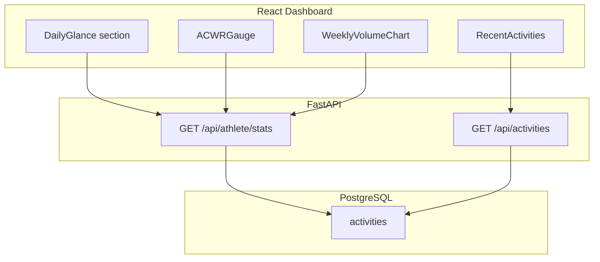

# Phase 4: Training Load Dashboard

## Context

The backend already stores imported Strava activities in PostgreSQL with `activity_date`, `distance_m`, and `moving_time_s` ([`backend/app/models.py`](backend/app/models.py)). The frontend Dashboard ([`frontend/src/components/Dashboard.jsx`](frontend/src/components/Dashboard.jsx)) currently shows profile, integrations, and an `ActivityHistory` child with a monthly Recharts bar chart. **Recharts is already installed** — no new chart dependency needed.

**Scope decisions (confirmed):**

- Acute/Chronic load and 8-week volume count **all sport types** (not run-only).
- Recent Activities uses the existing `GET /api/activities` endpoint (already sorted by `activity_date DESC`).

---

## Architecture



---

## 1. Backend: `/api/athlete/stats`

### New router

Create [`backend/app/routes/athlete.py`](backend/app/routes/athlete.py) with:

```python
router = APIRouter(prefix="/athlete", tags=["athlete"])

@router.get("/stats", response_model=AthleteStatsResponse)
def athlete_stats(athlete_profile_id: int = Query(...), db: Session = Depends(get_db)):
    ...
```

Register in [`backend/app/main.py`](backend/app/main.py):

```python
from app.routes import activities, athlete, athletes, ...
app.include_router(athlete.router, prefix="/api")
```

> Uses singular `/athlete` as requested (distinct from existing `/api/athletes` CRUD routes).

### Pydantic schemas

Add to [`backend/app/schemas.py`](backend/app/schemas.py):

```python
class WeeklyVolumeBucket(BaseModel):
    week_start: str          # ISO date, e.g. "2026-03-31"
    week_label: str          # Display label, e.g. "Mar 31"
    total_distance_km: float

class AthleteStatsResponse(BaseModel):
    acute_load_km: float
    chronic_load_km: float
    acwr: float | None       # null when chronic_load_km == 0
    weekly_volume_history: list[WeeklyVolumeBucket]  # 8 items, oldest → newest
```

### Query / calculation logic

Extract date-range helpers into [`backend/app/services/training_load.py`](backend/app/services/training_load.py) (keeps the router thin and testable):

| Metric            | Window                          | Formula                                                           |
| ----------------- | ------------------------------- | ----------------------------------------------------------------- |
| **Acute Load**    | Last 7 days (inclusive)         | `SUM(distance_m) / 1000`                                          |
| **Chronic Load**  | Last 28 days (inclusive)        | `(SUM(distance_m) / 1000) / 4`                                    |
| **ACWR**          | Derived                         | `acute_load_km / chronic_load_km` (return `null` if chronic is 0) |
| **Weekly Volume** | 8 non-overlapping 7-day buckets | 56-day lookback, bucketed oldest→newest                           |

**Date anchor:** `datetime.utcnow()` — consistent with existing naive UTC timestamps in the Activity table.

**SQL approach** (efficient vs loading all rows like `/summary`):

```python
from datetime import datetime, timedelta
from sqlalchemy import func

now = datetime.utcnow()
seven_days_ago = now - timedelta(days=7)
twenty_eight_days_ago = now - timedelta(days=28)
fifty_six_days_ago = now - timedelta(days=56)

base_filter = [
    Activity.athlete_profile_id == athlete_profile_id,
    Activity.activity_date >= fifty_six_days_ago,
    Activity.activity_date <= now,
]

# Acute: filter >= seven_days_ago
# Chronic: filter >= twenty_eight_days_ago
# Weekly: fetch (activity_date, distance_m) for 56-day window, bucket in Python
```

**Weekly bucketing algorithm:**

- Define 8 buckets: `[now-56d, now-49d)`, `[now-49d, now-42d)`, …, `[now-7d, now]`
- Sum `distance_m / 1000` per bucket
- Return `week_start` (bucket start date) and a short `week_label` for chart axis

All distance values rounded to 2 decimal places in the response.

---

## 2. Frontend: API client

Add to [`frontend/src/api/athlete.js`](frontend/src/api/athlete.js):

```javascript
export async function getAthleteStats(athleteProfileId) {
  const response = await fetch(
    `${API_BASE_URL}/api/athlete/stats?athlete_profile_id=${athleteProfileId}`,
  );
  return handleResponse(response);
}
```

Reuse existing `listActivities(athleteProfileId)` from [`frontend/src/api/activities.js`](frontend/src/api/activities.js) for the 5 most recent workouts (`activities.slice(0, 5)`).

---

## 3. Frontend: New components

Create focused components under `frontend/src/components/`:

### `DailyGlance.jsx`

- Fetches `getAthleteStats` + `listActivities` in parallel when `athleteProfileId` changes
- Handles loading / error / empty states
- Composes the grid layout below
- Re-fetches when `refreshKey` prop changes (wire to existing `historyRefreshKey` from import completion)

### `AcuteChronicCards.jsx`

- Two stat cards: **Acute Load (7d)** and **Chronic Load (28d avg/wk)**
- Display values in km with 1 decimal

### `ACWRGauge.jsx`

- Large ACWR number with colored status badge and SVG semi-circle gauge
- Color zones:
  - **Green** (`0.8 – 1.3`): sweet spot — `text-emerald-600`, `bg-emerald-50`
  - **Yellow** (`1.3 – 1.5`): caution — `text-amber-600`, `bg-amber-50`
  - **Red** (`> 1.5`): injury risk — `text-red-600`, `bg-red-50`
  - **Gray** (`< 0.8` or `null`): undertraining / insufficient data — `text-slate-500`
- Show zone label text ("Sweet Spot", "Caution", "High Risk", "Low Load")

### `WeeklyVolumeChart.jsx`

- Recharts `BarChart` using `weekly_volume_history` from stats API
- X-axis: `week_label`, Y-axis: km
- Light-mode styling: white card, soft shadow, slate grid lines, emerald bars (mirrors existing chart pattern in [`ActivityHistory.jsx`](frontend/src/components/ActivityHistory.jsx) but with light palette)

### `RecentActivities.jsx`

- List of 5 most recent activities: name, distance (km), elapsed time
- Reuse `formatDistanceKm` / `formatDuration` helpers (extract to `frontend/src/utils/formatters.js` to avoid duplication with `ActivityHistory.jsx`)

---

## 4. Frontend: Dashboard layout & light-mode styling

Update [`frontend/src/components/Dashboard.jsx`](frontend/src/components/Dashboard.jsx):

**Layout** (when profile exists):

```
┌─────────────────────────────────────────────┐
│  Daily Glance                               │
│  ┌──────────────┐  ┌──────────────┐         │
│  │ Acute Load   │  │ Chronic Load │         │
│  └──────────────┘  └──────────────┘         │
│  ┌──────────────┐  ┌──────────────────────┐ │
│  │ ACWR Gauge   │  │ 8-Week Volume Chart  │ │
│  └──────────────┘  └──────────────────────┘ │
│  Recent Activities (5 items)                │
└─────────────────────────────────────────────┘
│  Profile fields (existing grid)             │
│  ActivityHistory (full table, restyled)     │
```

**Light-mode design tokens** (replace current dark `slate-950` palette on Dashboard):

| Element         | Classes                                                  |
| --------------- | -------------------------------------------------------- |
| Page background | `bg-slate-50 text-slate-900`                             |
| Cards           | `bg-white rounded-2xl shadow-sm border border-slate-100` |
| Header          | `bg-white border-b border-slate-200 shadow-sm`           |
| Muted text      | `text-slate-500`                                         |
| Accent          | `emerald-500/600` (keep brand color)                     |

**Grid:** `grid gap-6 md:grid-cols-2` for stat cards; ACWR + chart in a `md:grid-cols-3` row (gauge 1 col, chart 2 cols).

Insert `<DailyGlance athleteProfileId={profile.id} refreshKey={historyRefreshKey} />` **above** the profile fields grid.

Also restyle [`frontend/src/components/ActivityHistory.jsx`](frontend/src/components/ActivityHistory.jsx) to match the light palette so the embedded table/chart doesn't clash. Remove or keep the existing monthly chart — recommend **keeping the full activity table** but **removing the duplicate monthly bar chart** since the new 8-week chart covers training load visualization.

---

## 5. Shared formatters

Create [`frontend/src/utils/formatters.js`](frontend/src/utils/formatters.js):

```javascript
export function formatDistanceKm(distanceM) { ... }
export function formatDuration(seconds) { ... }
export function formatDate(value) { ... }
```

Update `ActivityHistory.jsx` to import from here.

---

## Files changed (summary)

| File                                                                                             | Action                                           |
| ------------------------------------------------------------------------------------------------ | ------------------------------------------------ |
| [`backend/app/schemas.py`](backend/app/schemas.py)                                               | Add `WeeklyVolumeBucket`, `AthleteStatsResponse` |
| [`backend/app/services/training_load.py`](backend/app/services/training_load.py)                 | **New** — date-range queries + bucketing         |
| [`backend/app/routes/athlete.py`](backend/app/routes/athlete.py)                                 | **New** — `GET /stats` endpoint                  |
| [`backend/app/main.py`](backend/app/main.py)                                                     | Register athlete router                          |
| [`frontend/src/api/athlete.js`](frontend/src/api/athlete.js)                                     | Add `getAthleteStats`                            |
| [`frontend/src/utils/formatters.js`](frontend/src/utils/formatters.js)                           | **New** — shared format helpers                  |
| [`frontend/src/components/DailyGlance.jsx`](frontend/src/components/DailyGlance.jsx)             | **New**                                          |
| [`frontend/src/components/ACWRGauge.jsx`](frontend/src/components/ACWRGauge.jsx)                 | **New**                                          |
| [`frontend/src/components/WeeklyVolumeChart.jsx`](frontend/src/components/WeeklyVolumeChart.jsx) | **New**                                          |
| [`frontend/src/components/RecentActivities.jsx`](frontend/src/components/RecentActivities.jsx)   | **New**                                          |
| [`frontend/src/components/Dashboard.jsx`](frontend/src/components/Dashboard.jsx)                 | Light-mode restyle + embed DailyGlance           |
| [`frontend/src/components/ActivityHistory.jsx`](frontend/src/components/ActivityHistory.jsx)     | Light-mode restyle, remove monthly chart         |

---

## Verification

1. Start backend + frontend with imported Strava data present.
2. `GET /api/athlete/stats?athlete_profile_id=1` returns acute/chronic/acwr + 8 weekly buckets.
3. Dashboard shows Daily Glance with correct km values and ACWR color zone.
4. 8-week bar chart renders with chronological labels.
5. Recent Activities shows 5 newest workouts with distance and duration.
6. Trigger a Strava import refresh — stats section re-fetches via `historyRefreshKey`.
