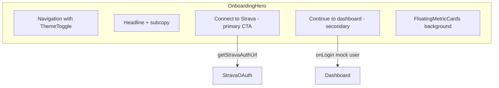

# Premium UI Overhaul — Dark/Light Mode + Animations

## Current State

- Frontend uses **Tailwind CSS v4** via `@tailwindcss/vite` with no `tailwind.config.js` — theme config lives in [`frontend/src/index.css`](frontend/src/index.css).
- [`Login.jsx`](frontend/src/components/Login.jsx) is a dark mock email/password form; Strava OAuth lives in [`Dashboard.jsx`](frontend/src/components/Dashboard.jsx).
- Phase 4 training load UI exists in [`DailyGlance.jsx`](frontend/src/components/DailyGlance.jsx), [`ACWRGauge.jsx`](frontend/src/components/ACWRGauge.jsx), [`WeeklyVolumeChart.jsx`](frontend/src/components/WeeklyVolumeChart.jsx) — light-mode only, no animations.
- `getStravaAuthUrl()` already supports optional `athleteProfileId` ([`frontend/src/api/strava.js`](frontend/src/api/strava.js)), so Strava connect works from onboarding without a profile.

**Confirmed onboarding flow:** Strava as primary CTA, secondary “Continue to dashboard” mock sign-in link.

---

## 1. Install Dependencies

```bash
cd frontend && npm install framer-motion lucide-react
```

---

## 2. Tailwind Dark Mode + Design Tokens

Update [`frontend/src/index.css`](frontend/src/index.css):

```css
@import "tailwindcss";

@custom-variant dark (&:where(.dark, .dark *));

@theme {
  --color-sage: #6b9080;
  --color-sage-muted: #a4c3b2;
  --color-amber-status: #d4a574;
  --color-danger-muted: #c1777a;
  --color-recovery: #6b9ac4;
  --color-surface-light: #f8f7f4;
  --color-card-light: #ffffff;
  --color-surface-dark: #111827;
  --color-card-dark: #1f2937;
}

body {
  @apply bg-surface-light text-slate-900 transition-colors duration-300;
  dark:bg-surface-dark dark:text-slate-100;
}
```

**Dark mode strategy:** class-based — toggle `dark` on `<html>` via React context, persisted to `localStorage`.

No separate `tailwind.config.js` needed (Tailwind v4 convention).

---

## 3. Theme System

### New files

| File                                                                                 | Purpose                                                                                                 |
| ------------------------------------------------------------------------------------ | ------------------------------------------------------------------------------------------------------- |
| [`frontend/src/context/ThemeProvider.jsx`](frontend/src/context/ThemeProvider.jsx)   | `theme` state, `toggleTheme()`, `localStorage` sync, applies `dark` class to `document.documentElement` |
| [`frontend/src/components/ThemeToggle.jsx`](frontend/src/components/ThemeToggle.jsx) | Sun/Moon icon button using `lucide-react`, `motion` tap scale                                           |
| [`frontend/src/components/Navigation.jsx`](frontend/src/components/Navigation.jsx)   | Shared top nav: brand, theme toggle, optional logout/user actions                                       |
| [`frontend/src/utils/statusColors.js`](frontend/src/utils/statusColors.js)           | Semantic palette mapping for ACWR zones                                                                 |

### Wire up in [`frontend/src/main.jsx`](frontend/src/main.jsx)

```jsx
<ThemeProvider>
  <BrowserRouter>
    <App />
  </BrowserRouter>
</ThemeProvider>
```

### ACWR zone → semantic colors

| Zone               | Color         | Use               |
| ------------------ | ------------- | ----------------- |
| 0.8–1.3 Sweet Spot | **Sage**      | Optimal           |
| 1.3–1.5 Caution    | **Amber**     | Caution           |
| > 1.5 High Risk    | **Muted Red** | Injury risk       |
| < 0.8 Low Load     | **Cool Blue** | Recovery          |
| null               | Slate         | Insufficient data |

Each zone exports light + dark Tailwind class sets (text, bg, border, gauge stroke).

---

## 4. Shared UI Primitives

### [`frontend/src/components/ui/MetricCard.jsx`](frontend/src/components/ui/MetricCard.jsx)

“Big numbers, small labels” pattern:

```jsx
// value: "168.5 km" (text-4xl font-bold)
// label: "ACUTE LOAD" (text-xs uppercase tracking-widest text-slate-500)
```

Card shell classes:

- Light: `bg-white shadow-md shadow-slate-200/60 border-slate-100`
- Dark: `bg-gray-800 border-white/10 shadow-none`

### [`frontend/src/components/ui/AnimatedCard.jsx`](frontend/src/components/ui/AnimatedCard.jsx)

Framer Motion wrapper used across dashboard:

```jsx
<motion.div
  variants={{ hidden: { opacity: 0, y: 24 }, visible: { opacity: 1, y: 0 } }}
  whileHover={{ y: -4, transition: { duration: 0.2 } }}
  className="... hover:border-sage/30 dark:hover:border-white/20"
/>
```

Parent container uses `staggerChildren: 0.08` + `delayChildren: 0.1`.

---

## 5. Login → Hero Onboarding Overhaul

Refactor [`frontend/src/components/Login.jsx`](frontend/src/components/Login.jsx) into a full-screen hero:



### Layout

- Full viewport hero with gradient mesh background (light: warm off-white; dark: deep slate with subtle radial glow).
- [`FloatingMetricCards.jsx`](frontend/src/components/onboarding/FloatingMetricCards.jsx): 4–5 preview cards (ACWR 1.12, 42.3 km acute, HRV 68 ms, 8-week sparkline label) positioned absolutely, each with slow `y` float animation (`animate={{ y: [0, -12, 0] }}` loop, staggered delays, reduced opacity/blur for depth).
- Center content: headline (“Your AI Fitness Coach”), value prop, prominent Strava button.

### Strava CTA styling

```jsx
<motion.button
  whileHover={{ scale: 1.03 }}
  whileTap={{ scale: 0.98 }}
  className="... bg-[#FC4C02] shadow-lg shadow-orange-500/30 hover:shadow-orange-500/50"
>
  <Activity icon from lucide-react /> Connect with Strava
</motion.button>
```

- Primary: calls `getStravaAuthUrl()` (no profile required), redirects to OAuth.
- Secondary: subtle text link “Continue to dashboard” → existing mock `onLogin({ email, name })`.

### [`StravaCallback.jsx`](frontend/src/components/StravaCallback.jsx)

Restyle to match hero theme + auto-login on success:

- Update [`App.jsx`](frontend/src/App.jsx) to pass `onLogin` to `StravaCallback` (or lift user state) so successful OAuth auto-enters dashboard without re-visiting login.

---

## 6. Navigation Extraction

Replace inline headers in Login and Dashboard with [`Navigation.jsx`](frontend/src/components/Navigation.jsx):

```
[Advance Athlete Lab logo]          [ThemeToggle] [Log out]
```

- Login variant: no logout button.
- Dashboard variant: shows logout + user email chip.
- Sticky top bar with backdrop blur: `backdrop-blur-md bg-white/80 dark:bg-gray-900/80`.

---

## 7. Dashboard Premium Restyle

Refactor [`Dashboard.jsx`](frontend/src/components/Dashboard.jsx):

- Page shell: `bg-surface-light dark:bg-gray-900 min-h-screen`
- Replace inline header with `<Navigation />`
- Wrap all card sections in a stagger-animated `motion.div` container
- Apply dual-theme card classes to integrations, profile fields, empty states
- Integrations section: use lucide icons (`Link`, `Upload`, `CheckCircle2`) for visual hierarchy

### Component updates

| Component                                                                | Changes                                                                                                                    |
| ------------------------------------------------------------------------ | -------------------------------------------------------------------------------------------------------------------------- |
| [`AcuteChronicCards.jsx`](frontend/src/components/AcuteChronicCards.jsx) | Use `MetricCard` + `AnimatedCard`; big number / small label                                                                |
| [`ACWRGauge.jsx`](frontend/src/components/ACWRGauge.jsx)                 | Semantic status colors; animate gauge arc with `motion.path` (`pathLength` 0→1 over 1.2s); animate number with `useSpring` |
| [`WeeklyVolumeChart.jsx`](frontend/src/components/WeeklyVolumeChart.jsx) | Dark-aware grid/axis/tooltip colors; Recharts `animationDuration={1200}` + `animationBegin` stagger per bar                |
| [`RecentActivities.jsx`](frontend/src/components/RecentActivities.jsx)   | `AnimatedCard` list items; lucide `Footprints`/`Timer` icons; dual-theme                                                   |
| [`DailyGlance.jsx`](frontend/src/components/DailyGlance.jsx)             | Stagger container orchestrating all child cards                                                                            |
| [`ActivityHistory.jsx`](frontend/src/components/ActivityHistory.jsx)     | Dark table styling (`dark:bg-gray-800`, `dark:divide-white/10`)                                                            |

### Design system cheat sheet

| Element    | Light                | Dark                                 |
| ---------- | -------------------- | ------------------------------------ |
| Page bg    | `bg-[#f8f7f4]`       | `bg-gray-900`                        |
| Card bg    | `bg-white shadow-md` | `bg-gray-800 border border-white/10` |
| Muted text | `text-slate-500`     | `text-slate-400`                     |
| Hover      | lift + shadow deepen | lift + border glow `border-white/20` |

---

## 8. Animation Spec (Framer Motion)

| Interaction      | Implementation                                                                          |
| ---------------- | --------------------------------------------------------------------------------------- |
| Dashboard mount  | `motion.div` container, `initial="hidden"` `animate="visible"`, `staggerChildren: 0.08` |
| Card hover       | `whileHover={{ y: -4 }}` + border/shadow transition                                     |
| ACWR gauge       | `motion.path` with animated `strokeDashoffset` from full arc to target value            |
| ACWR number      | `motion.span` with `useSpring` from 0 to acwr                                           |
| Volume bars      | Recharts built-in grow animation (`isAnimationActive`, 1200ms ease-out)                 |
| Hero float cards | Infinite `y` oscillation, 4–6s duration, per-card delay                                 |
| Strava button    | `whileHover={{ scale: 1.03 }}` + CSS glow shadow                                        |
| Theme toggle     | `whileTap={{ scale: 0.9 }}`, icon rotate transition                                     |

---

## 9. Files Summary

**New (8 files):**

- `context/ThemeProvider.jsx`
- `components/ThemeToggle.jsx`
- `components/Navigation.jsx`
- `components/onboarding/FloatingMetricCards.jsx`
- `components/ui/MetricCard.jsx`
- `components/ui/AnimatedCard.jsx`
- `utils/statusColors.js`

**Modified (11 files):**

- `package.json` (deps)
- `index.css` (dark variant + tokens)
- `main.jsx` (ThemeProvider)
- `App.jsx` (StravaCallback auto-login)
- `Login.jsx` (hero overhaul)
- `Dashboard.jsx`
- `DailyGlance.jsx`
- `AcuteChronicCards.jsx`
- `ACWRGauge.jsx`
- `WeeklyVolumeChart.jsx`
- `RecentActivities.jsx`
- `ActivityHistory.jsx`
- `StravaCallback.jsx`

**No backend changes required.**

---

## 10. Verification

1. `npm install` succeeds; `npm run dev` starts cleanly.
2. Theme toggle persists across refresh; all pages respect dark/light.
3. Onboarding hero shows floating metric cards + Strava CTA with hover glow.
4. “Continue to dashboard” mock login still works.
5. Dashboard cards stagger in on mount; hover lift works.
6. ACWR gauge arc animates from 0; volume bars grow on load.
7. Status colors map correctly: Sage / Amber / Muted Red / Cool Blue.
8. Strava OAuth callback auto-enters dashboard with matching theme.
