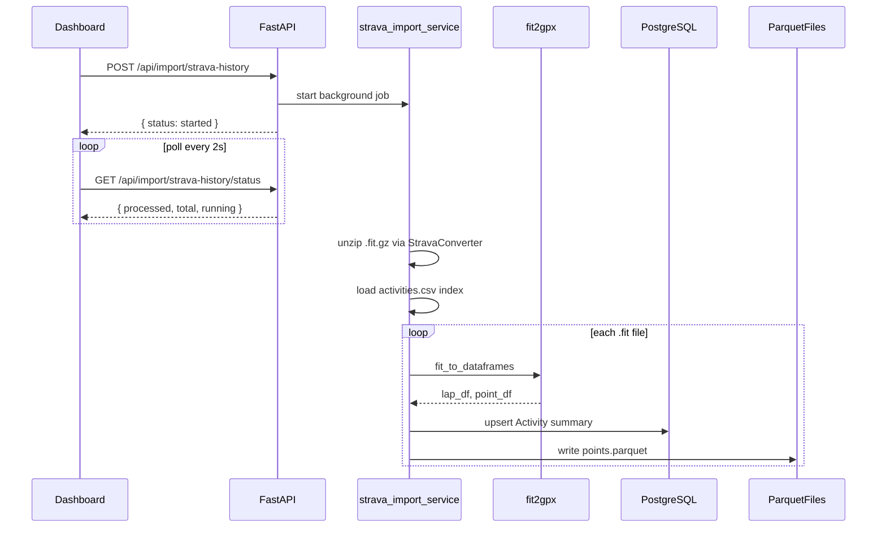

# Phase 2 Part 2: Strava Bulk Export Historical Import

## Decisions (based on your answers)

| Decision           | Choice                                                | Rationale                                                                                                              |
| ------------------ | ----------------------------------------------------- | ---------------------------------------------------------------------------------------------------------------------- |
| Export path        | `STRAVA_EXPORT_DIR` in [`backend/.env`](backend/.env) | Button triggers import; no path input in UI                                                                            |
| Point data storage | **Parquet files on disk**                             | 4 years of 1 Hz data = millions of rows; Parquet is compact, fast to write from pandas, and avoids bloating PostgreSQL |
| Import execution   | **Background task + status polling**                  | Full history import may take minutes; avoids HTTP timeout                                                              |

## Architecture



---

## 1. Database Models

Extend [`backend/app/models.py`](backend/app/models.py):

### `Activity` (summary table)

| Column               | Type                           | Notes                                               |
| -------------------- | ------------------------------ | --------------------------------------------------- |
| `id`                 | PK                             | Internal ID                                         |
| `athlete_profile_id` | FK → `athlete_profiles.id`     | Required on import                                  |
| `strava_activity_id` | BigInteger, unique per athlete | Parsed from filename (`1234567890.fit`)             |
| `name`               | String                         | From `activities.csv` or fallback `"Activity {id}"` |
| `activity_date`      | DateTime                       | From CSV or first lap/point timestamp               |
| `distance_m`         | Float                          | Sum of lap distances (meters)                       |
| `moving_time_s`      | Integer                        | Sum of lap elapsed times (seconds)                  |
| `average_heartrate`  | Float, nullable                | Weighted avg from laps or CSV                       |
| `max_heartrate`      | Float, nullable                | Max across laps or CSV                              |
| `sport_type`         | String, nullable               | From CSV if present                                 |
| `points_file_path`   | String, nullable               | Relative path to Parquet file                       |
| `source_fit_file`    | String                         | Original FIT filename for traceability              |
| `created_at`         | DateTime                       | Import timestamp                                    |

**Unique constraint:** `(athlete_profile_id, strava_activity_id)` — skip already-imported activities on re-run.

No separate `ActivityPoint` table in this phase; Parquet holds second-by-second data linked via `points_file_path`.

Add Pydantic schemas in [`backend/app/schemas.py`](backend/app/schemas.py): `ActivityRead`, `ActivityListResponse`, `ImportStartResponse`, `ImportStatusResponse`.

---

## 2. Import Service

Create [`backend/app/services/strava_import.py`](backend/app/services/strava_import.py) — shared by API and CLI.

### Config (add to [`backend/app/config.py`](backend/app/config.py))

```env
STRAVA_EXPORT_DIR=/absolute/path/to/unzipped/strava_export
ACTIVITY_POINTS_DIR=backend/data/activity_points   # default, gitignored
```

### Processing steps

1. **Validate** `STRAVA_EXPORT_DIR` exists and contains `activities/` (standard Strava bulk export layout).
2. **Unzip** `.fit.gz` / `.gpx.gz` files using `fit2gpx.StravaConverter(dir_in=export_dir).unzip_activities()`.
3. **Index metadata** from `activities.csv` (if present) keyed by Activity ID — name, date, distance, elapsed time, HR fields, sport type.
4. **Discover FIT files** — glob `activities/*.fit` recursively; parse `strava_activity_id` from basename.
5. **For each file** (skip if already in DB):
   - Call existing [`backend/app/utils/fit_converter.py`](backend/app/utils/fit_converter.py) → `lap_df, point_df`
   - **Summary extraction from `lap_df`:**
     - `distance_m` = sum of `total_distance` (or equivalent column; handle missing cols gracefully)
     - `moving_time_s` = sum of `total_elapsed_time`
     - `max_heartrate` = max of `max_heart_rate`
     - `average_heartrate` = distance-weighted mean of `average_heart_rate`
     - `activity_date` = earliest lap `start_time` if CSV date absent
   - **Prefer CSV values** for name/date/distance/HR when available (CSV is Strava's canonical summary).
   - **Points extraction from `point_df`:** normalize columns to `timestamp, heart_rate, cadence, speed, power, altitude` (map fit2gpx variants like `enhanced_speed`).
   - **Write Parquet:** `data/activity_points/{athlete_profile_id}/{strava_activity_id}.parquet`
   - **Insert/update** `Activity` row with `points_file_path`.
6. **Track progress** in module-level state: `{ running, total, processed, imported, skipped, errors[] }`.

Create thin CLI wrapper [`backend/scripts/import_strava_history.py`](backend/scripts/import_strava_history.py):

```bash
python scripts/import_strava_history.py --athlete-profile-id 1
```

Calls the same service synchronously (useful for debugging without the UI).

---

## 3. API Routes

Create [`backend/app/routes/import_history.py`](backend/app/routes/import_history.py) and [`backend/app/routes/activities.py`](backend/app/routes/activities.py).

Register in [`backend/app/main.py`](backend/app/main.py):

| Method | Path                                | Purpose                                                                    |
| ------ | ----------------------------------- | -------------------------------------------------------------------------- |
| `POST` | `/api/import/strava-history`        | Start background import for `athlete_profile_id` (body or query)           |
| `GET`  | `/api/import/strava-history/status` | Return job progress                                                        |
| `GET`  | `/api/activities`                   | List activities for athlete (`?athlete_profile_id=1`, sorted by date desc) |
| `GET`  | `/api/activities/summary`           | Aggregated stats for chart (monthly distance + activity count)             |

Import endpoint uses FastAPI `BackgroundTasks` to call `run_import(athlete_profile_id)`.

Return `409` if import already running.

---

## 4. Dependencies

Add to [`backend/requirements.txt`](backend/requirements.txt):

```
pyarrow    # Parquet write support for pandas
```

(`fit2gpx` and `pandas` already listed.)

Add to [`.gitignore`](.gitignore): `backend/data/activity_points/`

**Note:** `fit2gpx` may require Python 3.11/3.12 (known install issue on 3.13). Document in README.

---

## 5. Frontend Updates

### API module — [`frontend/src/api/activities.js`](frontend/src/api/activities.js)

- `startStravaHistoryImport(athleteProfileId)`
- `getImportStatus()`
- `listActivities(athleteProfileId)`
- `getActivitySummary(athleteProfileId)`

### Dashboard — [`frontend/src/components/Dashboard.jsx`](frontend/src/components/Dashboard.jsx)

Add to the **Integrations** section (below Strava connect):

- **Import History** button — calls `POST /api/import/strava-history`
- Progress bar / status text while polling `GET /api/import/strava-history/status` every 2s
- Disable button while import is running

Add new **Activity History** section (when profile exists):

- **List:** table/cards showing name, date, distance (km), moving time, avg/max HR
- **Chart:** install `recharts`, render a simple bar chart of monthly total distance (from `/api/activities/summary`)

Create [`frontend/src/components/ActivityHistory.jsx`](frontend/src/components/ActivityHistory.jsx) to keep Dashboard readable.

Styling: reuse existing slate/emerald Tailwind patterns from current Dashboard cards.

---

## 6. Environment Setup

Add to [`.env.example`](.env.example) and **`backend/.env`**:

```env
STRAVA_EXPORT_DIR=/Users/you/Downloads/strava_export
ACTIVITY_POINTS_DIR=./data/activity_points
```

Your unzipped export should look like:

```
strava_export/
├── activities.csv
└── activities/
    ├── 1234567890.fit
    ├── 9876543210.fit.gz   # auto-unzipped by import service
    └── ...
```

---

## 7. Verification

```bash
# 1. Set STRAVA_EXPORT_DIR in backend/.env
# 2. Start backend + frontend
# 3. Create athlete profile, click Import History
# 4. Confirm progress completes

curl "http://localhost:8000/api/activities?athlete_profile_id=1"
curl "http://localhost:8000/api/activities/summary?athlete_profile_id=1"

# CLI alternative
cd backend && python scripts/import_strava_history.py --athlete-profile-id 1
```

Check PostgreSQL `activities` table and `backend/data/activity_points/` for Parquet files.

---

## Files Summary

**Create:**

- `backend/app/services/strava_import.py`
- `backend/app/routes/import_history.py`
- `backend/app/routes/activities.py`
- `backend/scripts/import_strava_history.py`
- `frontend/src/api/activities.js`
- `frontend/src/components/ActivityHistory.jsx`

**Modify:**

- `backend/app/models.py`, `schemas.py`, `config.py`, `main.py`
- `backend/requirements.txt`, `.env.example`, `.gitignore`
- `frontend/package.json`, `Dashboard.jsx`
- `README.md` (import setup section)
