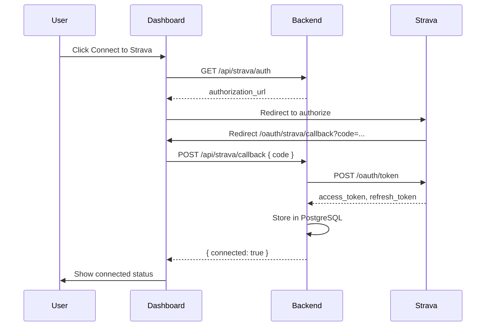
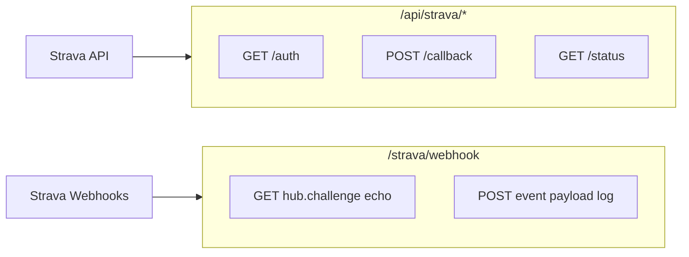

# Phase 2: Strava Wearable Data Integration

## Current Baseline

Phase 1 is a minimal stack with no routing, no real auth, and no third-party integrations:

- Backend entry: [`backend/app/main.py`](backend/app/main.py) — registers routers under `/api`
- Only router today: [`backend/app/routes/athletes.py`](backend/app/routes/athletes.py)
- Frontend: conditional render in [`frontend/src/App.jsx`](frontend/src/App.jsx), API via [`frontend/src/api/athlete.js`](frontend/src/api/athlete.js)
- Docker: **PostgreSQL only** ([`docker-compose.yml`](docker-compose.yml)); backend runs on host — no backend Dockerfile exists yet
- Env template: [`.env.example`](.env.example) with `DATABASE_URL` and `VITE_API_URL`

## Architecture





**Security choice:** Strava `client_secret` and token exchange stay on the backend. The frontend only redirects and forwards the OAuth `code`.

---

## 1. Backend — Strava OAuth Router

### New files / modules

| File                                                           | Purpose                                      |
| -------------------------------------------------------------- | -------------------------------------------- |
| [`backend/app/routes/strava.py`](backend/app/routes/strava.py) | OAuth + status endpoints under `/api/strava` |
| [`backend/app/config.py`](backend/app/config.py)               | Centralized env loading (optional but clean) |

### Endpoints (mounted at `/api/strava`)

| Method | Path        | Behavior                                                                                     |
| ------ | ----------- | -------------------------------------------------------------------------------------------- |
| `GET`  | `/auth`     | Build Strava authorize URL from env vars; return `{ "authorization_url": "..." }`            |
| `POST` | `/callback` | Accept `{ "code": "..." }`, exchange at `https://www.strava.com/oauth/token`, persist tokens |
| `GET`  | `/status`   | Return whether a Strava connection exists (for Dashboard UI)                                 |

**Token exchange** (via new `httpx` dependency):

```python
POST https://www.strava.com/oauth/token
{
  "client_id": STRAVA_CLIENT_ID,
  "client_secret": STRAVA_CLIENT_SECRET,
  "code": code,
  "grant_type": "authorization_code"
}
```

**Authorize URL params:**

- `client_id`, `response_type=code`, `redirect_uri`, `approval_prompt=force`
- `scope=read,activity:read_all` (enough for activity webhooks + future FIT downloads)

### Data model

Extend [`backend/app/models.py`](backend/app/models.py):

```python
class StravaConnection(Base):
    __tablename__ = "strava_connections"
    id, athlete_profile_id (FK, nullable for Phase 2), strava_athlete_id,
    access_token, refresh_token, expires_at, created_at
```

Add matching Pydantic schemas in [`backend/app/schemas.py`](backend/app/schemas.py): `StravaCallbackRequest`, `StravaAuthUrlResponse`, `StravaConnectionStatus`.

For Phase 2 (mock login, no user-to-athlete mapping), store **one connection row** — upsert on callback. `athlete_profile_id` can be optional query param on `/auth` for future linking.

### Register router in [`backend/app/main.py`](backend/app/main.py)

```python
from app.routes import athletes, strava

app.include_router(athletes.router, prefix="/api")
app.include_router(strava.router, prefix="/api")
```

---

## 2. Backend — Strava Webhook Router

User requirement: endpoint at **`/strava/webhook`** (not under `/api`).

Create [`backend/app/routes/strava_webhook.py`](backend/app/routes/strava_webhook.py):

| Method                 | Handler                                                                                                                                                                                                              |
| ---------------------- | -------------------------------------------------------------------------------------------------------------------------------------------------------------------------------------------------------------------- |
| `GET /strava/webhook`  | Read query params `hub.mode`, `hub.challenge`, `hub.verify_token`. If `hub.mode == "subscribe"` and verify token matches `STRAVA_WEBHOOK_VERIFY_TOKEN`, return `{"hub.challenge": hub.challenge}` with 200 within 2s |
| `POST /strava/webhook` | Parse JSON body, `print()` payload to console (activity create/update events), return 200 immediately                                                                                                                |

Register **without** `/api` prefix:

```python
app.include_router(strava_webhook.router)  # router prefix="/strava"
```

**Local dev note:** Strava webhooks require a **public HTTPS URL**. For testing, use ngrok (e.g. `https://abc123.ngrok.io/strava/webhook`) and create a subscription via Strava's API. Document this in README env section — no subscription-creation endpoint needed for Phase 2.

---

## 3. Backend — FIT File Processing Placeholder

### Dependencies

Add to [`backend/requirements.txt`](backend/requirements.txt):

```
httpx
fit2gpx
pandas
```

No backend Dockerfile exists; Docker Compose only runs Postgres. Requirements update is sufficient for the current host-run backend. If a backend Dockerfile is added later, it will inherit from `requirements.txt`.

### New utility

Create [`backend/app/utils/fit_converter.py`](backend/app/utils/fit_converter.py):

```python
from fit2gpx import Converter
import pandas as pd

def fit_file_to_dataframes(fit_path: str) -> tuple[pd.DataFrame, pd.DataFrame]:
    converter = Converter()
    frames = converter.fit_to_dataframes(fit_path)
    # Return lap_df, point_df — placeholder demonstrating future pipeline
    return frames["laps"], frames["points"]
```

This is a non-routed placeholder; no API endpoint yet.

---

## 4. Frontend — OAuth Flow

### Add routing

Install `react-router-dom`. Refactor [`frontend/src/App.jsx`](frontend/src/App.jsx):

- `/` — existing login/dashboard gate
- `/oauth/strava/callback` — dedicated callback page (works even if user isn't "logged in" to mock auth)

Wrap app in `BrowserRouter` in [`frontend/src/main.jsx`](frontend/src/main.jsx).

### New API module

Create [`frontend/src/api/strava.js`](frontend/src/api/strava.js) mirroring [`frontend/src/api/athlete.js`](frontend/src/api/athlete.js):

- `getStravaAuthUrl()` → `GET /api/strava/auth`
- `completeStravaOAuth(code)` → `POST /api/strava/callback`
- `getStravaConnectionStatus()` → `GET /api/strava/status`

### New callback component

Create [`frontend/src/components/StravaCallback.jsx`](frontend/src/components/StravaCallback.jsx):

1. Read `code` / `error` from URL search params
2. On mount, call `completeStravaOAuth(code)`
3. Show loading / success / error states (reuse slate/emerald Tailwind styling)
4. Redirect to `/` after success

### Dashboard integration

Update [`frontend/src/components/Dashboard.jsx`](frontend/src/components/Dashboard.jsx):

- Add **Integrations** card with **Connect to Strava** button
- On click: fetch auth URL, then `window.location.href = authorization_url`
- On load: call `getStravaConnectionStatus()` to show "Connected" vs "Not connected"
- Match existing button styles (emerald primary, slate border secondary)

---

## 5. Environment Variables

Add to [`.env.example`](.env.example) and copy into **`backend/.env`**:

```env
# Strava OAuth (backend only — never expose client_secret to frontend)
STRAVA_CLIENT_ID=your_client_id_here
STRAVA_CLIENT_SECRET=your_client_secret_here
STRAVA_REDIRECT_URI=http://localhost:5173/oauth/strava/callback

# Strava Webhook validation (choose any secret string; must match Strava subscription)
STRAVA_WEBHOOK_VERIFY_TOKEN=your_webhook_verify_token_here
```

| Variable                      | Where to put it | Notes                                                                                                                 |
| ----------------------------- | --------------- | --------------------------------------------------------------------------------------------------------------------- |
| `STRAVA_CLIENT_ID`            | `backend/.env`  | From Strava app settings                                                                                              |
| `STRAVA_CLIENT_SECRET`        | `backend/.env`  | From Strava app settings — **backend only**                                                                           |
| `STRAVA_REDIRECT_URI`         | `backend/.env`  | Must exactly match Strava app **Authorization Callback Domain** + path: `http://localhost:5173/oauth/strava/callback` |
| `STRAVA_WEBHOOK_VERIFY_TOKEN` | `backend/.env`  | Custom string you define; used during webhook subscription validation                                                 |
| `VITE_API_URL`                | `frontend/.env` | Already exists — no Strava secrets on frontend                                                                        |

**Strava developer portal setup:**

1. Create app at https://www.strava.com/settings/api
2. Set **Authorization Callback Domain** to `localhost`
3. Register redirect URI: `http://localhost:5173/oauth/strava/callback`
4. For webhooks (later): point callback URL to your ngrok URL + `/strava/webhook`

---

## 6. Verification Checklist

After implementation:

1. `pip install -r backend/requirements.txt` and restart Uvicorn
2. `npm install` in frontend (for react-router-dom)
3. Click **Connect to Strava** → authorize on Strava → land on callback → see success
4. `GET http://localhost:8000/api/strava/status` returns connected
5. Webhook GET validation:
   ```bash
   curl "http://localhost:8000/strava/webhook?hub.mode=subscribe&hub.challenge=test123&hub.verify_token=YOUR_TOKEN"
   # → {"hub.challenge":"test123"}
   ```
6. Webhook POST logs payload to Uvicorn console

---

## Files Changed Summary

**Create:**

- `backend/app/routes/strava.py`
- `backend/app/routes/strava_webhook.py`
- `backend/app/config.py` (or inline env in strava routes)
- `backend/app/utils/fit_converter.py`
- `frontend/src/api/strava.js`
- `frontend/src/components/StravaCallback.jsx`

**Modify:**

- `backend/app/main.py`
- `backend/app/models.py`
- `backend/app/schemas.py`
- `backend/requirements.txt`
- `.env.example`
- `frontend/package.json`
- `frontend/src/main.jsx`
- `frontend/src/App.jsx`
- `frontend/src/components/Dashboard.jsx`

**Optional doc update:** Add Strava env vars and webhook ngrok note to [`README.md`](README.md) (minimal section only).
